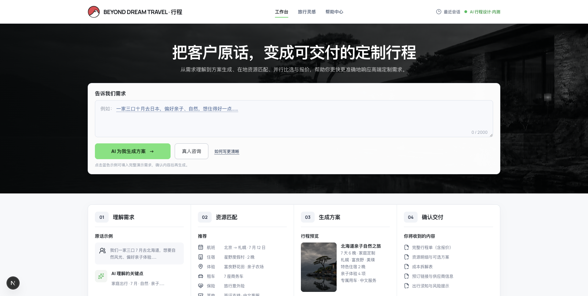
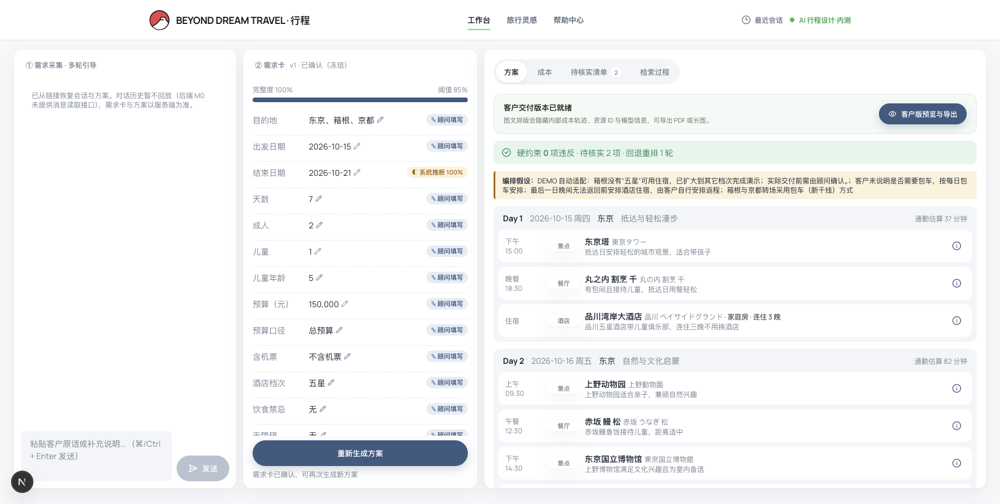
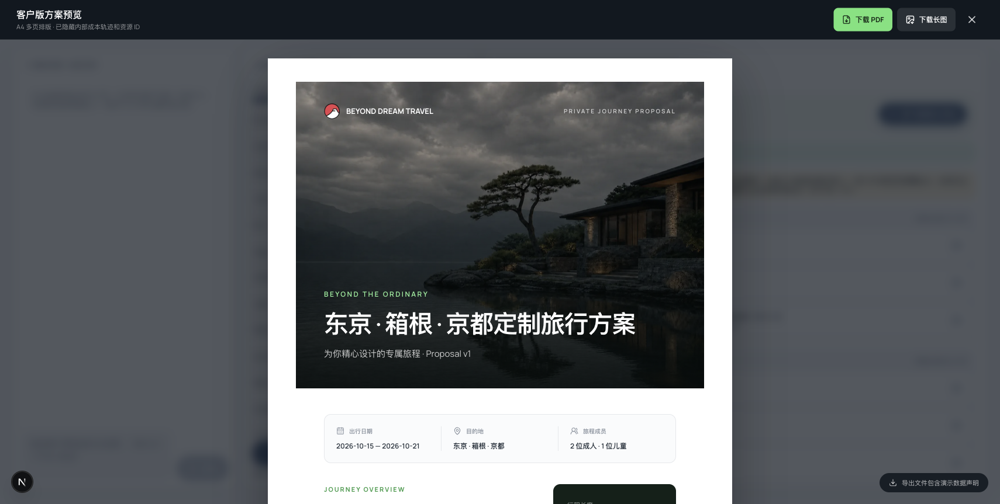

# zAI Travel Bot · 行策

> 将客户的一段旅行原话，转化为可追溯、可核验、可交付的高端定制旅行方案。

zAI Travel Bot 是为旅行顾问设计的 AI 行程方案工作台。它不是只产出泛化文案的聊天机器人：系统会把需求拆解为结构化需求卡、在人机确认后从资源池中筛选与编排行程、进行约束与成本校验，并输出可直接给客户查看的图文 PDF 或长图。

> 当前资源数据均为演示用模拟数据，不代表真实供应商库存、价格或可售状态。

## 在线预览

本地启动后可访问：

- 前端工作台：<http://localhost:3000>
- 后端 API 文档：<http://localhost:8000/docs>

## 界面预览

### 从客户原话开始

首页提供自然语言输入与可点击的演示需求。顾问可以先粘贴客户原话，再由 AI 提取信息并进行多轮补问。

### 顾问工作台：对话、需求卡、方案同步呈现

工作台将需求采集、结构化需求卡和行程方案放在同一视图。每项需求都有来源标记，生成过程保留约束校验、待核实项和重排次数；演示模式下对酒店档次的兼容放宽也会明确标记。

### 客户版交付预览与导出

当硬约束全部通过后，顾问可打开客户版方案预览并下载多页 PDF 或长图。交付版本自动隐藏内部成本轨迹、资源 ID、价格档 ID 和模型信息。

## 核心能力

| 能力 | 说明 |
| --- | --- |
| 自然语言需求采集 | 从客户原话提取目的地、日期、天数、同行人、预算、酒店档次、饮食禁忌、无障碍需求、偏好和节奏等槽位。 |
| 多轮 AI 引导 | 信息不足时，AI 以顾问可直接转述的方式继续提问；必问项不能被静默默认。 |
| 结构化需求卡 | 每一个字段标明客户原话、顾问填写或系统推断及置信度；冻结后的修改会生成新版本，保留溯源。 |
| 自动推导日期 | 已填写出发日期和天数时，系统自动计算结束日期，避免需求卡信息断裂。 |
| 人工确认关卡 | 需求完整度达到阈值且必问项、冲突项处理完成后才允许生成方案。 |
| 资源检索与编排 | 依据目的地、日期、人数、儿童政策、酒店档次与偏好筛选资源，再生成逐日行程。 |
| 三道事实防线 | 模型只选择资源 ID；服务端校验 ID 在候选池中、回填数据库事实、再次比对字段，避免捏造资源事实或价格。 |
| 约束与成本校验 | 对日期、容量、儿童、饮食、无障碍、行李等进行通过、拦截、待核实三态校验，并通过规则引擎计算成本。 |
| 可恢复生成 | 日期、目的地或酒店档次造成候选不足时，界面会给出可一键应用的明确修改建议，而不是卡在失败页。 |
| 演示友好模式 | DEMO_MODE=true 下，某城市没有所选酒店档次时，只兼容其它档次；日期、容量、儿童政策和资源引用校验仍然生效。 |
| 客户交付物 | 支持客户版预览、A4 多页 PDF 和长图导出；自动移除内部资源 ID、净价线索、价格档与模型信息。 |
| DeepSeek / Claude | 支持 DeepSeek 与 Anthropic Claude；模型异常时可降级到确定性编排器，保障演示流程连续。 |

## 工作流

~~~
客户原话
  ↓ 槽位抽取 / PII 脱敏
多轮需求引导
  ↓
带来源标记的需求卡
  ↓ 顾问确认：完整度、必问项、冲突项
资源硬过滤与候选池构建
  ↓
AI / 确定性编排行程
  ↓
资源引用校验 → 约束校验 → 必要时重排
  ↓
成本核算与待核实清单
  ↓
客户版 PDF / 长图交付
~~~

## 技术架构

| 层级 | 技术与职责 |
| --- | --- |
| 前端 | Next.js 16、React 19、TypeScript、Tailwind CSS；三栏顾问工作台、任务轮询、客户版方案渲染与 PDF/长图导出。 |
| 后端 | FastAPI、Pydantic、SQLAlchemy；提供会话、需求卡、检索、生成任务、方案与溯源 API。 |
| 数据 | PostgreSQL 16；资源、价格计划、会话、需求卡、方案版本、生成任务和日志独立建模。 |
| AI | Anthropic Messages API 或 DeepSeek Anthropic 兼容接口；Pydantic JSON Schema 约束结构化输出。 |
| 可靠性 | 后台任务状态落库、心跳与孤儿任务恢复、模型重试、模型失败后确定性编排回退。 |
| 安全 | 客户 PII 脱敏后才持久化或发送模型；角色权限、API Key 鉴权、服务端成本权限控制。 |

## 项目结构

~~~
zAI-Travel-Bot/
├── backend/
│   ├── app/
│   │   ├── api/v1/          # conversations / plans / search / trace
│   │   ├── core/            # 配置、鉴权、LLM、错误、隐私与数据库
│   │   ├── models/          # 资源与业务 SQLAlchemy 模型
│   │   ├── schemas/         # Pydantic 槽位、方案、成本与 API Schema
│   │   └── services/        # 抽取、需求卡、检索、编排、校验、成本、任务
│   ├── alembic/             # 数据库迁移
│   └── tests/               # 后端单元与集成测试
├── frontend/
│   ├── app/                 # Next.js 路由与首页
│   ├── components/          # 共享 UI、导航、帮助与过渡
│   ├── features/            # 会话、需求卡、方案、工作台功能模块
│   ├── e2e/                 # Playwright 端到端测试
│   └── tests/               # Vitest 组件与逻辑测试
├── seed/                    # 演示资源数据生成与装载脚本
├── eval/                    # 规则层评测与真实模型冒烟
├── docs/                    # PRD、技术适配文档与 README 截图
└── docker-compose.yml       # PostgreSQL 开发环境
~~~

## 快速开始

### 1. 环境要求

- Node.js 20+
- Python 3.11+
- Docker Desktop（推荐，用于 PostgreSQL）或可用的 PostgreSQL 16

### 2. 配置数据库和 Python 环境

~~~bash
git clone https://github.com/CageEcho/zAI-Travel-Bot.git
cd zAI-Travel-Bot

# 推荐：启动 PostgreSQL 16
docker compose up -d

# 创建 Python 虚拟环境并安装依赖
python3.11 -m venv .venv
source .venv/bin/activate
pip install -r backend/requirements.txt

# 创建本地配置，不要提交 .env
cp .env.example .env

# 执行迁移并导入演示资源
(cd backend && alembic upgrade head)
python seed/generate.py
python seed/load.py
~~~

不使用 Docker 时，可在 .env 将 DATABASE_URL 配置为 embedded:///.pgdata，由应用启动内嵌 PostgreSQL。

### 3. 配置模型

在根目录 .env 中配置 DeepSeek：

~~~dotenv
LLM_PROVIDER=deepseek
DEEPSEEK_API_KEY=sk-你的密钥
DEEPSEEK_MODEL=deepseek-v4-pro
PLANNER_MODE=llm
DEMO_MODE=true
DEMO_SAFE_DATE=2026-10-15
~~~

密钥只保存在本机 .env，该文件已被 .gitignore 排除；不要把 API Key 提交到 GitHub 或发送到公开渠道。

也可以切换 Claude：

~~~dotenv
LLM_PROVIDER=anthropic
ANTHROPIC_API_KEY=你的密钥
PLANNER_MODE=llm
~~~

如果暂时没有模型密钥，可使用确定性编排模式完成界面与规则层测试：

~~~dotenv
PLANNER_MODE=heuristic
DEMO_MODE=true
~~~

### 4. 启动服务

打开两个终端：

~~~bash
# 终端 A：后端
cd backend
../.venv/bin/uvicorn app.main:app --reload --port 8000

# 终端 B：前端
cd frontend
npm install --legacy-peer-deps
npm run dev
~~~

访问：

- http://localhost:3000：产品界面
- http://localhost:8000/docs：API 文档

## 常用配置

| 配置 | 默认或示例 | 用途 |
| --- | --- | --- |
| LLM_PROVIDER | deepseek / anthropic | 选择模型供应商。 |
| DEEPSEEK_API_KEY | sk-... | DeepSeek 密钥。 |
| DEEPSEEK_MODEL | deepseek-v4-pro | DeepSeek 模型名。 |
| ANTHROPIC_API_KEY | sk-ant-... | Claude 密钥。 |
| PLANNER_MODE | llm / heuristic | LLM 编排或确定性编排。 |
| DEMO_MODE | true | 演示时允许有限的酒店档次兼容，不跳过核心约束。生产必须设为 false。 |
| DEMO_SAFE_DATE | 2026-10-15 | 演示恢复建议使用的稳定日期。 |
| AUTH_ENABLED | false | 本地演示关闭；生产环境应开启。 |
| API_KEYS_JSON | JSON 字符串 | 开启鉴权后为角色分配 API Key。 |
| DATABASE_URL | PostgreSQL URL | 数据库连接。 |

### 代理与证书

当开发机通过企业代理或本地 HTTPS 调试代理访问模型服务时，应用会把 SSL_CERT_FILE 的代理证书与系统 CA 合并，仍保持 TLS 校验开启。只有系统 CA 不在默认路径时，才需要设置：

~~~dotenv
LLM_CA_BUNDLE=/path/to/ca-bundle.pem
~~~

请勿以关闭 TLS 校验来规避证书问题。

## API 概览

所有 API 均使用 /api/v1 前缀；完整定义以启动后的 Swagger 为准。

| 方法 | 路径 | 作用 |
| --- | --- | --- |
| POST | /conversations | 创建会话与空白需求卡。 |
| POST | /conversations/{conv_id}/messages | 提交客户原话，触发槽位抽取与下一轮引导。 |
| GET | /conversations/{conv_id}/card | 读取当前需求卡。 |
| PATCH | /conversations/{conv_id}/card | 顾问修订字段；已确认卡会生成新版本。 |
| POST | /conversations/{conv_id}/card/confirm | 校验完整度、必问项和冲突后冻结需求卡。 |
| POST | /plans | 异步创建方案任务。 |
| GET | /plans/{plan_id}/status | 轮询检索、编排、校验与成本任务状态。 |
| GET | /plans/{plan_id}/versions/{version} | 获取完成的方案、校验项和成本摘要。 |

## 测试与质量检查

~~~bash
# 后端：单元 / 集成测试
(cd backend && python -m pytest -q)

# 规则层评测，不调用模型
python eval/run.py --dry-run

# 真实模型冒烟，会消耗模型额度
python eval/smoke_real_model.py

# 前端：静态检查、单测、构建和端到端测试
(cd frontend && npm run lint)
(cd frontend && npm run typecheck)
(cd frontend && npm run test)
(cd frontend && npm run build)
(cd frontend && npm run e2e)
~~~

端到端测试覆盖从需求提交到方案生成、候选不足后的恢复建议、客户版交付入口等核心闭环。

## 隐私、权限与数据边界

- 客户姓名、电话、邮箱、微信、证件号和地址会在入库和发送模型前脱敏。
- 需求字段保留来源；模型不直接决定价格、资源事实或供应商数据。
- 金额只由服务端成本规则引擎计算，模型输出中不包含价格字段。
- 默认演示身份为 local-advisor。部署时请开启 AUTH_ENABLED=true，并为销售、顾问、主管、采购和管理员设置独立高熵 API Key。
- 销售等无成本权限角色由后端直接移除净价、价格档和价格来源，避免仅依赖前端隐藏。
- 演示资源是合成数据；用于真实生产前需接入真实供应商、库存、价格和预订链路，并关闭 DEMO_MODE。

## 产品边界与下一步

当前版本已经实现需求采集、顾问确认、资源筛选与编排、校验到客户版导出的第一阶段完整闭环。后续可继续接入：

- 真实供应商库存、报价与预订链接；
- CRM、客户档案与咨询记录；
- 地图路由、实时交通与天气；
- 方案协作、审批、版本对比与客户反馈；
- 云端部署、组织级鉴权、监控与审计。

## 相关文档

- [产品需求文档（PRD-v2）](docs/高端旅行智能方案生成平台-PRD-v2.md)
- [实施版 PRD（v3）](docs/PRD-v3-实施版.md)
- [第一阶段技术开发文档](docs/技术适配声明与第一阶段技术开发文档.md)
- [前端技术开发文档](docs/前端技术适配声明与第一阶段前端开发文档.md)
- [前端开发说明](frontend/README.md)

---

Built for premium travel consultants · Beyond Dream Travel · 行策
