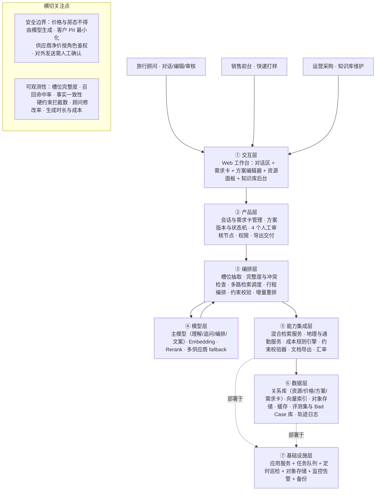
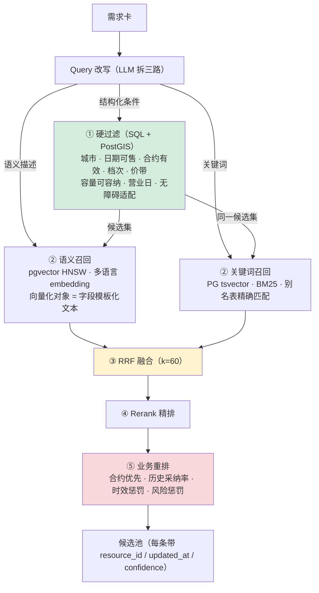
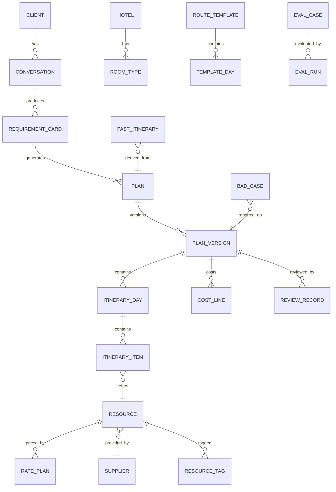

# 产品需求文档（PRD）
# 高端旅行智能方案生成平台「行策」

---

**文档性质** · 自主设计项目的产品需求文档
**项目代号** · travel-plan-studio
**文档版本** · v2.0
**设计周期** · 2026.04 – 2026.07
**角色** · 产品设计（业务诊断 / 产品方案 / 知识库标准 / 检索结构 / 评测框架 / 原型）
**配套交付物** · 6 页可交互原型（`prototype/index.html`）

> **关于本文档的两点说明**
>
> 1. 这是一份**面向真实业务问题的完整产品设计**，业务场景来自日本高端定制游的一线观察，
>    但项目**未在生产环境落地**。因此本文档中：
>    - 所有**设计内容**（槽位、约束、字段标准、检索结构、架构）是完整且可实施的设计成果；
>    - 所有**量化指标**均为**设计目标或待验证假设**，已在第 4.4 节与第 19 章统一标注，
>      **不存在任何实测结果的表述**。
>
> 2. 文档刻意保留了第 7 章「关键设计决策与权衡」——记录每个选择的**备选方案、决策依据和付出的代价**。
>    这一章比功能清单更能说明设计意图。

---

## 目录

**第一部分 · 问题与定位**
1. [产品概述](#1-产品概述)
2. [目标用户与使用场景](#2-目标用户与使用场景)
3. [术语定义](#3-术语定义)
4. [业务流程与问题诊断](#4-业务流程与问题诊断)
5. [产品范围与演进路线](#5-产品范围与演进路线)

**第二部分 · 设计主张**
6. [产品定位与核心闭环](#6-产品定位与核心闭环)
7. [关键设计决策与权衡](#7-关键设计决策与权衡) ⭐
8. [系统架构](#8-系统架构)

**第三部分 · 功能设计**
9. [功能需求详述](#9-功能需求详述)
10. [多轮对话与信息槽位设计](#10-多轮对话与信息槽位设计)
11. [旅行知识库设计](#11-旅行知识库设计)
12. [RAG 检索设计](#12-rag-检索设计) ⭐
13. [行程生成与约束体系](#13-行程生成与约束体系) ⭐
14. [防幻觉与可靠性设计](#14-防幻觉与可靠性设计) ⭐
15. [数据模型](#15-数据模型)
16. [交互与界面规范](#16-交互与界面规范)

**第四部分 · 质量与边界**
17. [非功能需求](#17-非功能需求)
18. [评测体系设计](#18-评测体系设计)
19. [验收标准（设计目标）](#19-验收标准设计目标)
20. [风险与开放问题](#20-风险与开放问题)
21. [附录：原型索引](#21-附录原型页面索引)

---

# 第一部分 · 问题与定位

## 1. 产品概述

### 1.1 一句话定位

**「行策」是面向高端旅行顾问的 AI 行程规划与产品推荐工作台**——顾问把客户的自然语言需求直接粘进系统，AI 通过多轮对话补齐关键条件，从结构化旅行知识库中检索真实资源，生成**可解释、可编辑、带成本结构**的按天行程与产品套餐，由顾问审核确认后交付客户。

### 1.2 业务背景

高端定制游（以日本市场为例）的业务特征：

| 特征 | 具体表现 | 对产品的含义 |
|---|---|---|
| **客单价高** | 团均十万级，人均数万级 | 一次错误的代价极高，容错空间小 |
| **需求高度个性化** | 房型、忌口、纪念日、体力、无障碍逐一不同 | 无法用标准化产品覆盖，必须支持个性组合 |
| **资源约束密集** | 房型容量、儿童入住年龄、休馆日、车辆行李容量、预约提前期 | 大量条件是**二值判断**而非偏好排序 |
| **信息时效强** | 协议价变动、酒店满房、餐厅歇业 | 资料一旦过期，方案发出即失误 |
| **交付依赖个人经验** | "哪家旅馆适合带小孩"存在于资深顾问脑中 | 隐性知识是产能瓶颈，也是可沉淀资产 |

### 1.3 要解决的问题

| 痛点 | 现状 | 本产品的解法 |
|---|---|---|
| **需求信息不完整** | 顾问访谈靠经验提问，常漏问预算口径、房型、饮食禁忌、纪念日，做到一半才发现返工 | 结构化**信息槽位 + 追问策略**，主动识别缺失、冲突、模糊三类问题；三项关键信息强制确认 |
| **资料分散** | 酒店合约在 Excel、房型图在网盘、餐厅信息在微信群、历史方案在个人电脑，共 6 个渠道 | 统一**旅行知识库**：字段标准 + 受控标签 + 时效与更新机制 |
| **资源匹配依赖个人经验** | 老顾问的隐性规则（车辆行李容量、儿童政策、地理动线）无法传递 | 把隐性规则显性化为**11 条硬约束 + 9 条软约束**的可维护规则集 |
| **方案反复修改** | 客户一句"预算降 20%"就要重排全程，手工重算成本 | **锁定 + 增量重排**：保留满意部分，只重排受影响项，成本由规则引擎实时重算 |
| **信息更新困难** | 涨价、歇业、休馆无人同步，方案发出才被打脸 | 资源**时效字段 + 置信度分档 + 过期预警 + 强制人工核实节点** |
| **交付周期长** | 一份完整方案的制作耗时长，且依赖特定顾问 | 目标：把顾问的角色从"资料拼装"转为"审核与增值" |

### 1.4 产品形态

- **Web 工作台**，内部系统优先，旅行顾问为主要操作者，响应式支持平板。
- **主界面三栏**：左侧对话区（需求采集） + 中间需求卡与方案编辑器 + 右侧资源检索与推荐面板。
- **可选前台**（二期）：客户侧只读方案预览页。
- **AI 定位**：AI 负责**理解、检索、编排、解释**；**价格、可用性、最终报价、对外发送**四类动作强制人工确认。

---

## 2. 目标用户与使用场景

### 2.1 用户画像

| 画像 | 特征 | 核心诉求 | 产品价值 |
|---|---|---|---|
| **资深旅行顾问**（主要用户） | 3 年以上高端定制经验，有稳定老客户，最烦重复劳动 | 少做拼装、多做增值；绝不能被 AI 带错 | 初稿自动化 + 全部资源可追溯，敢用 |
| **新人旅行顾问** | 入职 1 年内，不熟资源，反复请教老同事 | 快速做出"不外行"的方案 | 把隐性经验变成可用的推荐与约束提示 |
| **销售 / 客服前台** | 接第一手需求，不做方案设计 | 快速给客户一个像样的初步构想 | 对话式采集 + 概念级方案骨架 |
| **产品 / 采购运营** | 维护酒店合约、供应商、车队、餐厅资源 | 资料好维护、改一次全局生效 | 知识库后台 + 时效预警 + 变更影响面提示 |
| **定制游客户**（间接，二期直连） | 时间少、要求高、决策看细节 | 方案专业、有理由、改得快 | 只读方案页 + 可解释的推荐理由 |

### 2.2 典型使用场景

**S1 · 常规询单（主场景）**
顾问把客户微信里的一段话粘进对话框——"两大一小去日本，10 月中旬，7 天，想住好点的酒店，小孩 5 岁，预算 15 万左右"。系统识别已知槽位、追问缺失项（预算口径、饮食禁忌、酒店档次），生成结构化需求卡 → 顾问确认 → 一键生成 7 天行程初稿（含包车、亲子友好餐厅、儿童可入住房型）→ 顾问改 2 处 → 出报价单。

**S2 · 模糊需求打样**
客户只说"想去日本看红叶，人少一点的地方"。系统按季节知识与小众目的地标签给 2–3 个**方案骨架**（关西避峰 / 东北深度 / 中部秘境），客户选一个再细化。

**S3 · 预算重排**
客户回复"能不能压到 12 万"。顾问锁定"京都酒店不动"，系统给出降本路径（降级东京酒店 / 包车换新干线 / 减 1 晚），每条标注成本差与**体验损失说明**。

**S4 · 资源替换**
目标旅馆当日满房。顾问点击该条目 → 系统给出同区域、同档次、同价带的替代资源，附结构化差异对比（温泉类型、儿童政策、步行距离）。

**S5 · 历史方案复用**
顾问搜"去年那个九州包车 6 天的家庭团" → 命中历史方案 → 一键复制为模板 → 更新日期与人数后重算价格与可用性。

**S6 · 资源维护**
运营在后台调整某酒店旺季价格 → 系统列出**引用该资源的在途方案**，提示对应顾问复核。

### 2.3 非目标用户（明确不服务）

- 大众散拼团、机票分销、纯 OTA 比价用户。
- 完全无人值守的对客自动成交（价格与可用性必须过人）。

---

## 3. 术语定义

| 术语 | 含义 |
|---|---|
| **需求卡（Requirement Card）** | 结构化旅行需求对象，槽位集合 + 完整度评分 + 冲突列表，是生成方案的唯一输入，版本化 |
| **槽位（Slot）** | 一条结构化需求字段（如 `budget.basis`），含取值域、必填等级、置信度、来源（客户原话 / 顾问填写 / 系统推断） |
| **完整度（Completeness）** | 必填槽位填充比例；达阈值才允许生成完整方案，未达阈值只能生成"方案骨架" |
| **资源（Resource）** | 知识库中的可用实体：酒店、房型、车辆、餐厅、门票体验、景点 POI、接送产品 |
| **价格档（Rate Plan）** | 资源在某时间区间、某人数结构下的价格规则（含季节加价、儿童政策、含餐、取消政策、来源置信度） |
| **路线模板（Route Template）** | 经验沉淀的可复用行程骨架（如"关西经典 5 日"），含天数、城市序列、节奏标签 |
| **历史方案（Past Itinerary）** | 已交付的真实方案，既是检索语料也是推荐依据 |
| **方案（Plan）** | 一次生成结果：按天行程 + 产品推荐 + 成本结构 + 说明文案，有版本号与状态 |
| **行程项（Itinerary Item）** | 方案中某天的一个条目（住宿 / 交通 / 餐饮 / 景点 / 体验 / 自由时间），绑定 `resource_id` |
| **硬约束 / 软约束** | 硬约束必须满足，违反则拦截或显式警示；软约束尽量满足，违反需说明 |
| **锁定（Lock）** | 顾问把某条目或某整日标为不可变，重排时保持不动 |
| **增量重排（Incremental Replan）** | 仅重排未锁定且受变更影响的部分，保留其余内容与版本谱系 |
| **可解释性（Explainability）** | 每个推荐项都能回答"为什么是它"：命中的槽位、满足的约束、来源资源 ID 与更新时间 |
| **混合检索（Hybrid Retrieval）** | 结构化硬过滤 + 语义召回 + 关键词召回 + 融合重排的组合检索结构 |
| **字段模板化文本** | 把结构化字段渲染为自然语言句子后再向量化的做法（区别于直接向量化官方描述） |
| **Bad Case** | 评测或试用中发现的错误样本，归因为知识缺失 / 检索偏差 / 行程冲突 / 理解错误四类之一 |

---

## 4. 业务流程与问题诊断

### 4.1 传统定制游流程（AS-IS）

```
① 需求沟通（微信 / 电话 / 面谈，多轮，信息口述、无结构）
        ↓
② 资源查询（酒店官网 / 供应商邮件 / Excel 合约 / 网盘房型图 / 微信问同事）
        ↓
③ 行程设计（凭经验按天排，Word/PPT 手打，反复调地理顺序与节奏）
        ↓
④ 成本核算（Excel 手工累加：房晚 × 房型 × 季节价 + 车 + 餐 + 门票 + 加价）
        ↓
⑤ 报价销售（出 PPT/PDF 发客户 → 客户改需求 → 回到 ②③④ 循环）
        ↓
⑥ 成交后落地（预订、确认书、行前资料）—— 本产品不覆盖
```

### 4.2 问题树

```
方案交付慢、质量依赖个人经验
├── 需求信息不完整
│   ├── 提问靠经验，无标准清单 ················· → 槽位体系（第 10 章）
│   ├── 口径不统一（预算含不含机票）············ → 强制确认槽位
│   └── 冲突需求未及时发现 ····················· → 8 条冲突检测规则
├── 资料分散在 6 个渠道
│   ├── 无统一检索入口 ························· → 统一知识库（第 11 章）
│   ├── 字段不结构化，无法按条件筛选 ··········· → 字段标准四铁律
│   └── 更新无机制，信息过期 ··················· → 时效阈值 + 置信度分档
├── 资源匹配依赖个人经验
│   ├── 隐性规则在老顾问脑子里 ················· → 约束规则集显性化（第 13 章）
│   └── 新人不知道有什么资源可选 ··············· → 混合检索 + 推荐理由
└── 方案反复修改
    ├── 改一处全表重算 ························· → 规则引擎自动核算
    └── 无版本管理，改乱了回不去 ··············· → 版本 + 锁定 + 增量重排
```

### 4.3 TO-BE 流程与人机分工

| 步骤 | AI 负责 | 顾问负责 | 系统卡点 |
|---|---|---|---|
| 需求采集 | 抽取槽位、识别缺失/冲突/模糊、生成追问 | 校正误解、补充客户背景 | **需求卡需顾问确认**才进入生成 |
| 知识检索 | 混合检索、候选打分、给推荐理由与来源 | 判断资源是否"这个客户合适" | 检索结果必须带 `resource_id` 与更新时间 |
| 行程编排 | 按约束生成按天行程，标注冲突与假设 | 调顺序、换资源、锁定满意项 | 硬冲突必须提示，**不静默通过** |
| 成本核算 | 调用规则引擎累加，输出成本结构 | 核对价格档、加价、汇率 | **强制人工确认**：价格与可用性 |
| 方案交付 | 生成文案、行程说明、推荐理由 | 终稿审核、增值建议 | **强制人工确认**：对外发送 |
| 反馈迭代 | 增量重排、给降本/升级路径 | 与客户沟通取舍 | 每版留痕，可回溯 |

> **红线**：AI 不得凭空生成价格、房态、营业时间、房型容量。所有事实性字段必须来自知识库并携带来源与更新时间；缺失即显式标注"待人工核实"。

### 4.4 待验证假设 ⭐

> 本产品的优先级排序建立在以下假设之上。**这些假设来自一线定性观察，尚未经过量化验证。**
> 立项后的第一项工作应是用工时记录与历史方案复盘验证 H1–H3，因为它们直接决定产品优先级。

| 编号 | 假设 | 依据 | 验证方法 | 若假设不成立 |
|---|---|---|---|---|
| **H1** | 资源检索是顾问单方案工时的**最大占用项** | 一线观察：资料分散在 6 个渠道，新人尤其耗时 | 4 名顾问（2 资深 2 新人）× 2 周工时日志，30 分钟粒度 | 若编排才是最大项，产品重心应移向行程编排辅助而非检索 |
| **H2** | 方案返工的**最大成因是首次需求采集不完整**，而非方案设计质量 | 一线观察：常在做到一半时才发现漏问预算口径、忌口 | 抽取近 6 个月方案，逐份标注修改原因并分类 | 若最大成因是客户主动变卦，产品重心应移向增量重排与版本管理 |
| **H3** | 资深顾问与新人的产能差距主要来自**资源熟悉度**，而非编排能力 | 一线观察：新人的求助集中在"有哪些资源可选" | 对比两组顾问的工时分项结构 | 若差距在编排，需要的是路线模板与教学机制而非检索 |
| **H4** | 顾问对 AI 生成方案的接受门槛是**可追溯性**，而非生成质量 | 高客单价业务，顾问要为方案背书 | 原型可用性测试：对比"带来源标注"与"不带"两版的采纳意愿 | 若门槛是质量，应先提升编排水平再谈可解释性 |
| **H5** | 现有资源资料的**结构化程度不足以支撑硬过滤**（关键属性写在描述文本中） | 一线观察：房型容量、儿童政策常写在备注里 | 抽样统计关键字段的结构化率与完整度 | 若结构化程度已足够，可跳过数据治理直接做检索 |

> 💡 **这一节是本 PRD 最重要的自我约束**。假设 H5 尤其关键：如果它成立，那么**数据治理必须是第一里程碑，而不是与开发并行的任务**——这会显著改变项目排期。

---

## 5. 产品范围与演进路线

### 5.1 MVP 范围

**目标**：单一目的地国（日本）+ 3 类客户场景（家庭亲子、蜜月纪念、深度文化）跑通端到端链路，让一个小规模顾问团队日常可用。

| 模块 | MVP 范围 | 明确不做 |
|---|---|---|
| 多轮对话采集 | 18 个槽位、缺失追问、冲突提示、需求卡确认 | 语音输入、多语言（先中文） |
| 知识库 | 酒店/房型/价格档、包车与接送、餐厅、门票体验、景点 POI、路线模板、历史方案 | 机票、邮轮、保险、签证代办 |
| 检索 | 结构化过滤 + 双路召回 + 融合重排 + 来源引用 | 实时供应商 API 查价 |
| 行程生成 | 3–10 天按天行程，含住宿/交通/餐饮/景点，硬约束校验 + 回退重排 | 多方案自动 A/B 对比、跨国联程 |
| 产品推荐 | 酒店房型、包车方案、餐厅与体验推荐 + 替代建议 | 自动预订、库存锁定 |
| 方案编辑 | 拖拽调序、替换资源、锁定、增量重排、版本管理 | 富文本自由排版、多人协同同编 |
| 成本核算 | 规则引擎累加 + 成本结构展示 + 汇率与加价 | 佣金分成、财务对账、开票 |
| 交付 | 导出 PDF / Word 方案书 | 客户在线互动确认、电子签 |
| 评测 | 黄金测试集 + Bad Case 库 + 人工评分后台 | 自动化在线 A/B |

### 5.2 冷启动范围收敛 ⭐

**决策：MVP 只做东京、京都、箱根三城 + 3 类客户场景**（详见决策 D3）。

| 维度 | 全量方案 | MVP 收敛方案 |
|---|---|---|
| 城市 | 8 个（含大阪、北海道、冲绳、金泽、高山） | **3 个** |
| 客户场景 | 全部类型 | **3 类**（家庭亲子 / 蜜月纪念 / 深度文化） |
| 预估询单覆盖 | 100% | **约 71%** |
| 预估数据治理量 | 100% | **约 29%** |

**未覆盖城市的处理**：系统**明确显示"该目的地暂未覆盖"，不做降级硬生成**。这是刻意设计——宁可暴露能力边界，也不让顾问对系统产生"它会编"的印象。

### 5.3 演进路线

| 阶段 | 内容 |
|---|---|
| **二期** | 客户侧只读方案页 + 客户自助需求入口；多方案并行对比（经济/推荐/升级三档）；供应商自助报价上传与审核流；知识库自动巡检（过期价格、临期合约预警）；评测自动化回归 |
| **三期** | 多目的地扩展（东南亚、欧洲），目的地知识模块化插拔；预订执行链路（确认书、供应商单据、行前资料）；从历史成交反推定价与转化优化建议；把顾问的每次修改作为偏好信号回流优化排序 |

---

# 第二部分 · 设计主张

## 6. 产品定位与核心闭环

### 6.1 定位

**面向旅行顾问的 AI 方案生成工作台，不是面向客户的聊天机器人。**

价值主张：**把顾问从"资料搬运工"变回"旅行设计师"**。

### 6.2 核心闭环

```
自然语言需求
   → 槽位抽取与追问补全
   → 结构化需求卡【顾问确认 · 人工节点 1】
   → 知识库混合检索（结构化硬过滤 + 语义召回 + 融合重排）
   → 约束求解式行程编排（地理 / 时间 / 预算 / 偏好）
   → 按天行程 + 产品推荐 + 成本结构（全部带来源引用）
   → 顾问编辑与锁定
   → 【人工节点 2：价格核对】【人工节点 3：可用性核对】
   → 【人工节点 4：对外发送】
   → 报价单 / 方案书交付
   → 客户反馈 → 增量重排
   → 成交方案回流为历史方案资产 → 重新索引
```

---

## 7. 关键设计决策与权衡 ⭐

> 这一章记录七个决定产品形态的选择。每条包含**备选方案、决策、依据、代价**。

### D1 · 做「对话 + 工作台」三栏，不做纯对话式产品

| | 纯对话式 | **三栏工作台（选中）** |
|---|---|---|
| 交互 | 一问一答，方案在聊天流里 | 左对话 / 中需求卡与方案 / 右资源面板 |
| 优点 | 开发快，形态轻 | 状态可见、可直接编辑、信任感强 |
| 缺点 | 顾问看不到系统"理解成了什么"；改一处要用自然语言描述半天 | 开发成本高 |

**决策依据**：高客单价业务里，顾问要为方案**背书**。纯对话式的致命问题是顾问无法确认 AI 是否理解正确，只能自己再复查一遍——那就失去了效率意义。

**核心设计**：中间栏的**需求卡**，每个槽位显式展示 **值 + 来源 + 置信度**：

```
✓ 已确认（客户原话）    ◐ 系统推断（可一键确认）
⚠ 有冲突               ❗ 必须确认（不可静默假设）
```

**提炼的设计原则**：**专业工具类 AI 产品，"让用户看见 AI 的理解状态"比"让 AI 更聪明"更能建立信任。**

**代价**：前端复杂度显著上升；需求卡的槽位设计一旦变更，前后端都要动。

---

### D2 · 价格与事实字段绝不进入 LLM 生成路径（架构级隔离）

| | 端到端生成（LLM 输出完整方案含价格） | **Schema 隔离（选中）** |
|---|---|---|
| 实现 | 一次调用拿到完整 JSON | LLM 只输出 `resource_id` + 数量，事实字段渲染层回填 |
| 优点 | 简单，文案与数据一体 | **模型没有字段可以编** |
| 缺点 | 模型会在信息不足时"合理补全"价格、房型名、容量 | 需要额外的渲染层与校验层 |

**决策**：

```
LLM 输出：  { "type":"hotel", "resource_id":"HTL-KYO-0142",
              "room_id":"RM-8891", "nights":3 }
                        ↓ 渲染层
DB 回填：   酒店名 · 房型名 · 容量 · 单价 · 含餐 · 取消政策（全部来自库）
规则引擎：  单价 × 房晚 × 季节系数 + 儿童加床 + 服务费 = 金额
```

**LLM 的输出 schema 中不含任何金额、房型名称、营业时间、容量字段。**

**决策依据**：**提示词是概率约束，schema 是确定性约束。** 在"一次编错的房价发给客户就是商誉事故"的业务里，不能接受概率。大模型有一个隐蔽的失效模式——它会生成一个**看起来完全合理、但并不在检索结果中**的资源，这种最危险，因为它不像胡说。

**代价**：文案生成与数据渲染分离，AI 写的行程描述必须严格限制在"不引入库外事实"的范围内，提示词与后处理都更复杂。

---

### D3 · 先窄后宽：冷启动只做 3 城 + 3 类场景

**备选**：全量 8 城铺开 / 收敛到 3 城。

**决策**：收敛。用约 29% 的数据治理量覆盖约 71% 的询单量（依据长尾分布，需实际验证）。

**决策依据**：假设 H5（现有资料结构化程度不足）如果成立，数据治理的工作量会成为项目最大变量。在数据质量不达标的情况下扩大覆盖面，只会让每个目的地都"半生不熟"——而 RAG 产品的信任一旦崩塌就很难重建。

**代价**：未覆盖目的地的询单仍需手工处理，用户会有抱怨。**处理方式是明确显示"暂未覆盖"而不是硬生成**——用能力边界的诚实换取信任。

---

### D4 · 保留 4 个强制人工确认节点

| 节点 | 卡什么 | 为什么不能自动化 |
|---|---|---|
| 需求卡确认 | 顾问确认理解无误才生成 | 抽取错误会在下游放大 |
| 价格核对 | 未确认不得推进方案状态 | 协议价可能已变动 |
| 可用性核对 | 未确认不得导出 | 无实时房态接口 |
| 对外发送 | 二次确认 + 留痕 | 对客失误不可逆 |

**决策依据**：**高客单价业务里，"能自动化"和"该自动化"是两件事。** 产品的价值主张不是"无人化"，而是把顾问的时间从检索拼装转移到审核增值。审核环节本身就是产品能被业务接受的前提。

**代价**：自动化程度受限，流程中引入了新的等待环节；需要设计清晰的卡点提示，否则顾问会觉得"卡住了不知道为什么"。

---

### D5 · 硬过滤优先于向量召回（而非纯向量 RAG）

| | 纯向量 RAG | **硬过滤优先（选中）** |
|---|---|---|
| 结构 | 全库向量化 → 相似度 Top-K → 后置过滤 | SQL 硬过滤 → 候选集 → 向量与关键词双路召回 |
| 优点 | 实现简单，通用 | 不合规资源**根本不进候选池** |
| 缺点 | 会召回住不下客人的酒店；后置过滤会掏空 Top-K | 需要维护结构化字段 |

**决策依据**：旅行是**硬条件密集**的业务。房型装不下 3 个人、周一休馆、合约已过期——这些是**二值判断，不是相似度问题**。纯向量检索无法表达"必须"，只能表达"像"。

**量化理解**：在这个业务里，向量检索只解决约三成的问题（处理"安静有格调的温泉旅馆"这类模糊表达），另外七成靠结构化过滤。

**代价**：**强依赖字段结构化程度**。如果关键属性写在描述文本里（假设 H5），硬过滤会静默失效——这个风险已列入第 20 章。

---

### D6 · 抽取与理解交给模型，校验与核算交给规则

**决策**：明确划分两类任务。

| 任务类型 | 交给谁 | 例子 |
|---|---|---|
| **感知任务**（非结构化 → 结构化、理解意图、生成文案） | 模型 | 槽位抽取、追问生成、行程编排、推荐理由与文案 |
| **逻辑任务**（数值计算、阈值判断、二值校验） | 确定性代码 | 成本核算、约束校验、完整度计算、冲突检测 |

**决策依据**：把数值比对和条件判断交给模型是**能力误用**——它做得更慢、更贵、且不可复现。约束校验和成本核算必须每次给出相同结果，这是确定性代码的领域。

**代价**：规则引擎需要单独维护；约束规则变更时需要发版或配置化设计（本 PRD 选择配置化，见第 17 章）。

---

### D7 · PostgreSQL + pgvector，不引入专用向量库

| | 专用向量库（Milvus / Qdrant） | **PG + pgvector（选中）** |
|---|---|---|
| 向量性能 | 更强（千万级） | 满足预估量级（数万 chunk） |
| 结构化过滤 | 需两库协同，一致性难保证 | 同库一次 JOIN 查完 |
| 运维 | 多一套组件 | 复用现有 PG |

**决策依据**：承接 D5——本业务的典型查询是「京都 + 10/15–18 可售 + 5 星 + 能住 2 大 1 小 + 有私汤」，**先过滤再语义排序**。两库方案要么把过滤条件同步到向量库（数据一致性噩梦），要么先向量召回再过滤（召回质量崩坏）。同库能一次查完。

**量级判断**：预估索引规模在数万 chunk 量级，pgvector HNSW 足够；**上限预估约 50 万 chunk，届时再评估拆分**。

**代价**：向量检索性能上限低于专用库；若未来扩展到多目的地导致索引膨胀，需要迁移。

---

## 8. 系统架构

### 8.1 分层架构



**关键架构约束**：④ 模型层与 ⑤ 能力集成层**并列而非串联**。成本规则引擎与约束校验器属于 ⑤，**不经过模型层**——这是 D2 与 D6 在架构上的体现。

### 8.2 一次完整生成的时序

| # | 阶段 | 执行者 | 说明 |
|---|---|---|---|
| 1 | 顾问粘贴客户原话 | 用户 | 支持长段落、多条消息累积 |
| 2 | 槽位抽取 | 模型 | 结构化输出，含置信度与来源标注 |
| 3 | 完整度与冲突检查 | **规则** | 纯代码，不走模型 |
| 4 | 生成追问（≤3 问） | 模型 | 按优先级排序，能给选项不问开放题 |
| 5 | 顾问/客户作答 | 用户 | 循环 2–4 至达生成门槛 |
| 6 | **需求卡确认** | **人工节点 1** | 冻结为版本，后续修改产生新版本 |
| 7 | 多路检索（住宿/交通/餐饮/景点 4 路并发） | 检索服务 | 详见第 12 章 |
| 8 | 骨架匹配（路线模板 + 相似历史方案） | 检索服务 | 城市序列 + 住宿分配 |
| 9 | 逐日编排 | 模型 | 输出仅含 `resource_id`，不含事实字段 |
| 10 | 约束校验（11 硬 + 9 软） | **规则** | 详见第 13 章 |
| 11 | 违规回退重排（≤3 轮） | 模型 + 规则 | 仍违规则显式标注交人工 |
| 12 | 成本核算 | **规则引擎** | 从价格档读取，模型不参与 |
| 13 | 文案与理由组装 | 模型 | 严格限制不引入库外事实 |
| 14 | 顾问编辑与审核 | 用户 | 锁定 / 替换 / 增量重排 |
| 15 | **价格与可用性核对** | **人工节点 2、3** | 未确认则导出禁用 |
| 16 | **对外发送确认** | **人工节点 4** | 二次确认 + 留痕 |
| 17 | 成交方案回流 | 系统 | 写入历史方案库并重新索引 |

**设计要点**：步骤 9 与 13 是最耗时的模型环节，因此步骤 7–13 整体设计为**异步后台任务 + 前端进度轮询**，支持中断（见 F3-8）。

---

# 第三部分 · 功能设计

## 9. 功能需求详述

> 优先级：**P0** = MVP 必须；**P1** = MVP 期望；**P2** = 二期。

### 9.1 F1 会话与需求采集

| 编号 | 需求 | 优先级 | 验收要点 |
|---|---|---|---|
| F1-1 | 支持自由文本输入（长段粘贴、多条消息累积）建立会话 | P0 | 一段客户原话可一次抽出多个槽位 |
| F1-2 | 槽位抽取结果实时映射到需求卡，逐项显示来源与置信度 | P0 | 每个槽位标注「客户原话 / 顾问填写 / 系统推断」 |
| F1-3 | 缺失必填槽位时生成追问，**单轮最多 3 问**，按优先级排序 | P0 | 不重复追问已确认槽位；表达自然，不像表单 |
| F1-4 | 识别需求冲突并显式提示，给取舍建议与数字依据 | P0 | 8 条冲突规则全部可被触发 |
| F1-5 | 识别模糊表达并给可选项（"住好点的"→ 4 档 + 各档人均） | P0 | 提供枚举选项而非开放式追问 |
| F1-6 | 需求卡支持顾问直接编辑任一槽位，覆盖 AI 抽取结果 | P0 | 顾问填写优先级高于模型抽取，且记为偏好信号 |
| F1-7 | 完整度评分与"可生成"门槛提示；未达门槛可生成方案骨架 | P0 | 未达阈值时按钮态为"生成骨架" |
| F1-8 | 会话可保存、恢复、跨天继续 | P0 | 恢复后上下文一致 |
| F1-9 | 客户自助需求入口（对话式表单，不含价格） | P2 | — |

### 9.2 F2 知识检索

| 编号 | 需求 | 优先级 | 验收要点 |
|---|---|---|---|
| F2-1 | 按需求卡自动执行 4 路并发检索（住宿/交通/餐饮/景点体验） | P0 | 检索任务可在轨迹中查看 |
| F2-2 | 顾问可手动检索资源库（关键词 + 多维筛选） | P0 | 覆盖城市、档次、价带、标签、供应商、更新时间 |
| F2-3 | 每条结果展示关键结构化字段 + 更新时间 + 来源置信度 | P0 | 超时效价格显示"待核实"角标 |
| F2-4 | 检索结果可直接拖入方案指定日期 | P0 | 拖入后自动触发约束校验与成本重算 |
| F2-5 | 无匹配结果时给出放宽建议（放宽哪个条件可得几个结果） | P0 | 不返回空白页 |
| F2-6 | 历史方案检索（按目的地/天数/人数/预算/客户类型/成交状态） | P0 | 可一键"复制为模板" |

### 9.3 F3 行程生成

| 编号 | 需求 | 优先级 | 验收要点 |
|---|---|---|---|
| F3-1 | 生成 3–10 天按天行程，每天含时间段化条目 | P0 | 结构完整，无空日、无孤立条目 |
| F3-2 | 城市序列与住宿分配符合地理合理性（减少折返、连住优先） | P0 | 不出现同日跨两城以上（除必要转场日） |
| F3-3 | 每个条目附推荐理由（命中槽位 / 满足约束 / 来源） | P0 | 悬停即可见理由与 `resource_id` |
| F3-4 | 硬约束违规必须拦截或显式警示，**不静默通过** | P0 | 见 13.2，逐条可测 |
| F3-5 | 生成结果携带"假设与待核实清单" | P0 | 如"该价格更新于 X，需向供应商复核" |
| F3-6 | 生成骨架模式（完整度不足时）：城市序列 + 节奏 + 档次建议 | P0 | 骨架不含具体价格 |
| F3-7 | 生成过程可视化（检索中/编排中/核算中），支持中断 | P1 | 长任务走后台，前端轮询进度 |
| F3-8 | 多方案并行（经济/推荐/升级三档） | P2 | — |

### 9.4 F4 产品推荐

| 编号 | 需求 | 优先级 | 验收要点 |
|---|---|---|---|
| F4-1 | 酒店推荐给出 2–3 个同档候选 + 结构化差异对比 | P0 | 对比维度结构化，非纯文本 |
| F4-2 | 房型推荐匹配人数结构（含儿童年龄、加床、连通房） | P0 | **容量不匹配的房型不得出现** |
| F4-3 | 包车/接送推荐匹配人数 + 行李 + 路线（座位与行李双校验） | P0 | 6 人 6 箱不得推 5 座车 |
| F4-4 | 餐厅推荐匹配饮食禁忌、预算档、营业日、预约提前期、地理位置 | P0 | **命中禁忌的餐厅零出现** |
| F4-5 | 门票体验推荐匹配休馆日、体力强度、儿童/长者适宜性 | P0 | 周一休馆的馆不得排在周一 |
| F4-6 | 任一条目可一键"看替代方案" | P0 | 替代项同档同价带，展示差异说明 |

### 9.5 F5 方案编辑与版本

| 编号 | 需求 | 优先级 | 验收要点 |
|---|---|---|---|
| F5-1 | 按天时间轴视图，条目支持拖拽调序、跨日移动、删除、新增 | P0 | 操作后立即校验并提示冲突 |
| F5-2 | 条目/整日锁定，重排时保持不动 | **P0** | 锁定项在重排后完全一致 |
| F5-3 | 增量重排：变更只影响未锁定且受影响的范围 | **P0** | 变更 1 天不应导致其余天数被改写 |
| F5-4 | 版本管理：每次生成/重排产生新版本，可对比、可回滚 | P0 | diff 显示新增/删除/替换/价格变化 |
| F5-5 | 方案状态机：草稿 → 待审核 → 已审核 → 已交付 → 已成交/已放弃 | P0 | 状态推进受人工节点约束 |
| F5-6 | 方案内部批注（不对客可见） | P1 | 导出时不含内部批注 |

> ⚠️ **F5-2 与 F5-3 定为 P0 而非 P1**。理由：**"改比重做还慢"是这类产品最常见的死法。** 如果顾问改一处导致全盘重排，他会宁愿手工做。

### 9.6 F6 成本核算与人工审核

| 编号 | 需求 | 优先级 | 验收要点 |
|---|---|---|---|
| F6-1 | 成本结构自动核算（住宿/交通/餐饮/门票体验/司导/服务费/税） | P0 | 每项可下钻到"单价 × 数量 × 规则"明细 |
| F6-2 | **价格一律取自价格档，模型不得生成或修改数字** | P0 | 代码层面隔离：模型输出结构中无金额字段 |
| F6-3 | 支持币种与汇率，汇率来源与时间可见 | P0 | 汇率变动不自动改历史版本 |
| F6-4 | 儿童政策、加床、旺季加价、包车超时费按规则计算 | P0 | 规则可配置，变更留痕 |
| F6-5 | **强制人工确认：价格与可用性** —— 未确认不得推进 | P0 | 未确认时导出禁用，并说明缺什么 |
| F6-6 | **强制人工确认：对外发送/导出** | P0 | 二次确认弹窗，记录操作人与时间 |
| F6-7 | 预算达成度展示；超支时高亮并给降本路径 | P0 | 每条路径标注成本差与体验损失 |
| F6-8 | 净价与毛利视图，仅授权角色可见 | P0 | 后端过滤，非前端隐藏 |

### 9.7 F7 知识库后台

| 编号 | 需求 | 优先级 | 验收要点 |
|---|---|---|---|
| F7-1 | 11 类资源的增删改查，字段遵循第 11 章标准 | P0 | 必填字段缺失不得保存 |
| F7-2 | 批量导入（Excel/CSV 模板）+ 校验报告 | P0 | 导入不静默丢数据 |
| F7-3 | 标签体系维护（受控词表，禁止自由造词） | P0 | 新标签需审核后生效 |
| F7-4 | 时效管理：复核阈值、临期预警、置信度分档 | P0 | 临期资源在检索结果中带角标 |
| F7-5 | 变更影响面提示：改动某资源时列出引用它的在途方案 | P0 | 列表可点击跳转 |
| F7-6 | 变更审计日志 | P0 | 可按资源与操作人检索 |
| F7-7 | 供应商自助报价上传与审核流 | P2 | — |

### 9.8 F8 交付输出

| 编号 | 需求 | 优先级 | 验收要点 |
|---|---|---|---|
| F8-1 | 导出对客方案书（PDF），含封面、按天行程、酒店说明、含/不含项、报价、条款 | P0 | 排版稳定，无空字段占位符 |
| F8-2 | 导出内部核算表（Excel），含成本明细与供应商 | P0 | 仅授权角色 |
| F8-3 | 方案文案由模型生成，**事实字段来自库** | P0 | 文案不得引入库外事实 |
| F8-4 | 客户在线只读方案页（分享链接 + 有效期） | P2 | — |

### 9.9 F9 评测与运营后台

| 编号 | 需求 | 优先级 | 验收要点 |
|---|---|---|---|
| F9-1 | 黄金测试集管理（输入 + 期望要点 + 评分维度） | P0 | 支持批量跑测 |
| F9-2 | 人工评分入口（五维度打分 + 备注） | P0 | 见第 18 章 |
| F9-3 | Bad Case 记录与四类归因 | P0 | 一键从任意方案标记 |
| F9-4 | 指标看板 | P0 | 见 18.3 |
| F9-5 | 轨迹回放：查看某次生成的全过程 | P1 | 可复现问题定位 |

### 9.10 F10 权限矩阵

| 角色 | 会话与生成 | 方案编辑 | 净价/毛利 | 知识库维护 | 审核推进 | 评测后台 |
|---|---|---|---|---|---|---|
| 销售前台 | ✅ | 仅草稿 | ❌ | ❌ | ❌ | ❌ |
| 旅行顾问 | ✅ | ✅（本人） | ✅（本人方案） | ❌ | ✅ | 只读 |
| 资深顾问/主管 | ✅ | ✅（全部） | ✅ | ❌ | ✅ | ✅ |
| 运营采购 | 只读 | ❌ | ✅ | ✅ | ❌ | ✅ |
| 管理员 | ✅ | ✅ | ✅ | ✅ | ✅ | ✅ |

---

## 10. 多轮对话与信息槽位设计

### 10.1 槽位清单（18 个，三级）

**必填 7 个**（缺失阻塞完整方案生成）

| 槽位 | 取值域 | 说明 | 追问优先级 |
|---|---|---|---|
| `destination` | 受控词表（国/城） | 支持"日本"粗粒度，后续细化 | 1 |
| `dates.mode` + `dates.start/end` | 确定日期 / 大致月份 / 弹性 | 决定可用性校验强度 | 2 |
| `duration_days` | 3–15 | 与日期可互推，至少给两个 | 2 |
| `pax` | 成人 / 儿童（含年龄）/ 长者 | **儿童年龄直接决定房型与票价** | 3 |
| `budget.amount` + `currency` | 数值 + 币种 | | 4 |
| `budget.basis` | 总价 / 人均 | **口径必须问清** | 4 |
| `budget.includes_flight` | 是 / 否 / 未定 | 含不含机票差异可达 30% | 4 |
| `hotel.tier` | 4星 / 5星 / 奢华 / 温泉旅馆 / 设计精品 / 混合 | 支持按城市分档 | 5 |

**重要 7 个**（可给默认值但必须标注来源）

| 槽位 | 取值域 | 默认策略 |
|---|---|---|
| `hotel.room_config` | 房型 + 间数（大床/双床/家庭房/连通房/和室/带私汤） | 按人数结构推断，标"系统推断" |
| `interests` | 多选标签：美食/文化历史/亲子/购物/自然/温泉/滑雪/摄影/艺术设计/动漫/婚旅 | 空则按目的地经典款 |
| `pace` | 轻松 / 适中 / 紧凑 | 默认适中；有幼童或长者时默认轻松 |
| `transport.preference` | 全程包车 / 包车+新干线 / 公共交通 / 自驾 | 按人数与目的地推断 |
| `dietary.restrictions` | 无 / 素食 / 清真 / 无猪肉 / 过敏项 / 忌生食 | **不可静默假设为无** |
| `special.occasion` | 无 / 生日 / 蜜月 / 纪念日 / 求婚 / 毕业 | 影响升级与惊喜安排 |
| `accessibility` | 无 / 婴儿车 / 轮椅 / 行走不便 / 需电梯 | **不可静默假设为无** |

**可选 4 个**：`guide_language`、`previous_visits`（避免重复）、`must_have`（点名要的酒店/餐厅/体验）、`must_avoid`

### 10.2 追问策略

| 规则 | 内容 | 设计理由 |
|---|---|---|
| **单轮 ≤3 问** | 一次最多问 3 个 | 避免问卷感导致顾问放弃 |
| **优先级排序** | 必填 > 高影响（预算口径、饮食禁忌、儿童年龄）> 重要 > 可选 | 先问改变方案结构的 |
| **合并提问** | 语义相关的槽位合并成一句自然表达 | 日期 + 天数 + 弹性度可一句问完 |
| **给选项优先** | 能枚举就不问开放题 | "住好点的"→ 给 4 档 + 各档人均价 |
| **推断可见** | 能推断的先填并标"系统推断"，只请确认不重问 | 2 大 1 小 → 家庭房 1 间 |
| **不追问已知** | 已确认槽位不再问；顾问覆盖的值不被模型改写 | 信任前提 |
| **止损** | 同一槽位追问 ≤2 次，仍无结果则标"待客户确认"并按标注默认值继续 | 避免死循环 |

### 10.3 三项不可静默假设的强制确认 ⭐

| 槽位 | 为什么必须显式确认 | 风险场景 |
|---|---|---|
| **饮食禁忌** | 空值 ≠ 无禁忌 | 客户说"老人肠胃不好，生冷的少一点"，若抽取为空则可能排入寿司与刺身 |
| **无障碍需求** | 涉及安全与体验 | 长者行走不便却排入需大量登山的景点 |
| **预算口径** | 含不含机票差异可达 30% | 客户说 15 万含机票，方案按 15 万地面做，直接超支 |

**设计**：这三项缺失时**阻塞生成**，必须显式确认一次。这条规则来自一个通用原则——**在有硬性后果的场景里，空值必须显式处理，不能默认为"通过"**（同一原则也应用于第 13 章的约束校验）。

### 10.4 中文委婉表达的处理

中文客户表达高度委婉，**"少一点"往往就是"不要"**。设计三层处理：

1. **扩充抽取 schema**：区分「硬性禁忌」与「倾向性偏好」两类取值。
2. **few-shot 覆盖委婉表达**：肠胃不好 / 吃不惯 / 不太能接受 / 不太喜欢 / 尽量少 等。
3. **规则兜底**：出现"生冷 / 不习惯 / 肠胃 / 忌"等关键词但槽位为空时，**强制触发一次澄清追问**。

### 10.5 八条冲突检测规则

| # | 冲突 | 判定逻辑 | 提示方式 |
|---|---|---|---|
| C1 | 预算 vs 档次 | 档次均价 × 房晚 × 间数 > 预算 × 住宿合理占比 | 给「降档 / 减天 / 提预算」三路径 + 差额 |
| C2 | 天数 vs 城市数 | 城市数 > `floor(天数/2)` | 说明转场损耗 |
| C3 | 儿童/长者 vs 节奏 | 有 ≤6 岁儿童或长者 + `pace=紧凑` | 建议降为轻松，说明每日步行与车程 |
| C4 | 无障碍 vs 景点 | 需轮椅 + 含高台阶/山地景点 | 替换为无障碍友好项 |
| C5 | 季节 vs 目的地 | 樱花/红叶/滑雪季与日期不匹配 | 告知实际概率与替代目的地 |
| C6 | 旺季 vs 档次可用性 | 黄金周/盂兰盆/樱花季 + 奢华档 | 提示锁房时限与价格上浮区间 |
| C7 | 名店预约 vs 提前期 | `must_have` 含长提前期资源，距出行不足 | 提示预约概率低，给替代 |
| C8 | 房型 vs 人数 | 人数结构无法被所选房型容纳 | 给可行房型组合 |

**设计原则**：冲突提示必须带**数字依据**（"该档次 6 晚约 X 万，占预算 Y%"），并给出 2–3 条**取舍路径**。**系统不替客户降级要求，只呈现选项。**

---

## 11. 旅行知识库设计

### 11.1 知识分类（11 类实体）

| 类别 | 实体 | 用途 | 建议更新频率 |
|---|---|---|---|
| 住宿 | 酒店 / 房型 / 价格档 | 住宿推荐与核算 | 房态月级、价格季度级 |
| 交通 | 包车车型 / 司导 / 接送产品 / 城际交通 | 交通编排与核算 | 季度级 |
| 餐饮 | 餐厅（营业日、预约提前期、人均、菜系、禁忌适配） | 餐饮推荐 | 季度级 |
| 体验 | 景点门票 / 体验活动 | 白天内容编排 | 季度级 |
| 地理 | 景点 POI / 区域 / 通勤矩阵 | 地理合理性与通勤时长 | 半年级 |
| 经验 | 路线模板 / 历史方案 | 骨架复用与相似推荐 | 持续沉淀 |
| 知识 | 目的地知识（季节节庆、休馆规律、着装礼仪、避坑提示） | 约束与文案 | 半年级 |
| 支撑 | 供应商与合约 | 净价、结算、提前期 | 合约周期 |
| 支撑 | 受控标签词表 | 全库统一语义 | 按需审核 |

### 11.2 字段标准四铁律 ⭐

| # | 铁律 | 原因 | 反例 |
|---|---|---|---|
| **①** | **地理信息必带经纬度** | 地理聚类与通勤计算的前提 | 只有"京都市东山区"无法算通勤时长 |
| **②** | **价格必带时效与来源置信度** | 驱动"待核实"角标与导出卡点 | 没有 `updated_at` 就不知道该不该信 |
| **③** | **容量与适宜性必须结构化，不可仅写在描述中** | **硬过滤的前提** | "适合家庭入住"无法过滤；`max_children:2` 可以 |
| **④** | **必带 `status` 与 `updated_at`** | 时效管理与审计 | — |

> ⚠️ **铁律 ③ 是最关键的一条，也是最容易被忽略的**。如果关键属性写在 `description` 里，硬过滤会**静默失效**——检索看起来正常，但推出的资源实际不可用。这个风险已列入第 20 章（R2）。

### 11.3 字段标准示例

**酒店（Hotel）**

| 字段 | 类型 | 必填 | 说明 |
|---|---|---|---|
| `hotel_id` | string | ✅ | 全局唯一 |
| `name_zh` / `name_local` / `name_en` | string | ✅/✅/— | 中文名必填，便于顾问检索 |
| `alias[]` | string[] | — | **中日英别名与客户俗称**（见 12.5） |
| `country` / `city` / `district` | 受控词表 | ✅ | 三级地理 |
| `geo` | {lat,lng} | ✅ | 铁律 ① |
| `tier` | 枚举 | ✅ | 4星/5星/奢华/温泉旅馆/设计精品 |
| `category` | 枚举 | ✅ | 城市酒店/度假酒店/温泉旅馆/精品 |
| `tags[]` | 受控标签 | ✅ | 见 11.4 |
| `child_policy` | 结构化 | ✅ | **可入住年龄 / 免费年龄 / 加床规则 / 儿童餐**（铁律 ③） |
| `facilities[]` | 数组 | — | 泳池/健身/SPA/无障碍 |
| `distance_to[]` | 数组 | — | 到主要车站/机场/地标的距离与时长 |
| `supplier_ids[]` | 数组 | ✅ | 关联供应商 |
| `advisor_notes` | text | — | **顾问经验（隐性知识显性化的关键字段）** |
| `status` | 枚举 | ✅ | 启用/停用/待核实 |
| `updated_at` / `updated_by` | 时间/用户 | ✅ | 铁律 ④ |

**房型（RoomType）**

| 字段 | 类型 | 必填 | 说明 |
|---|---|---|---|
| `room_id` / `hotel_id` | string | ✅ | |
| `bed_config` | 结构化 | ✅ | 床型 × 数量（大床/双床/榻榻米） |
| `max_occupancy` / `max_adults` / `max_children` | int | ✅ | **硬约束 H1 的依据**（铁律 ③） |
| `min_child_age` | int | ✅ | 部分旅馆有最低入住年龄 |
| `extra_bed` | 结构化 | ✅ | 是否可加床/费用/年龄限制 |
| `features[]` | 受控标签 | — | 私汤/连通房/无障碍/客厅分离 |

**价格档（RatePlan）**

| 字段 | 类型 | 必填 | 说明 |
|---|---|---|---|
| `rate_id` / `resource_type` / `resource_id` | string | ✅ | 可挂在任意资源 |
| `valid_from` / `valid_to` | date | ✅ | **硬约束 H8 的依据** |
| `blackout_dates[]` | date[] | — | 不可用日期 |
| `net_price` / `currency` | 数值/枚举 | ✅ | 净价，权限受控 |
| `price_basis` | 枚举 | ✅ | 每间夜/每人/每车天/每次 |
| `meal_plan` | 枚举 | — | 不含餐/含早/半食宿/**一泊二食** |
| `season_type` | 枚举 | ✅ | 平季/旺季/特旺（黄金周·盂兰盆·跨年·樱花红叶） |
| `child_pricing` | 结构化 | — | 分年龄段价格规则 |
| `booking_lead_time_days` | int | — | **软约束 S8 的依据** |
| `confidence` | 枚举 | ✅ | **已确认合约价 / 参考价 / 历史价**（见 11.5） |
| `updated_at` | 时间 | ✅ | 铁律 ④ |

**车辆（Vehicle）** —— 只列关键字段，说明设计意图

| 字段 | 必填 | 说明 |
|---|---|---|
| `seats` | ✅ | 座位数 |
| `luggage_capacity_28inch` | ✅ | **等效 28 寸箱数** —— 硬约束 H4 的第二个维度 |

> 💡 **`luggage_capacity` 这个字段是隐性知识显性化的典型例子**：老顾问看到"6 人 6 箱"就知道要海狮而非阿尔法（座位够但行李装不下），新人不知道。把它变成字段和约束，经验就完成了沉淀。

### 11.4 标签体系（受控词表，7 分面 142 个标签）

| 分面 | 标签数 | 示例 | 作用 |
|---|---|---|---|
| 客群 | 12 | 亲子 / 蜜月 / 长者友好 / 大家庭 / 单人 | 匹配人数结构与场合 |
| 主题 | 26 | 美食 / 文化历史 / 自然 / 温泉 / 滑雪 / 购物 / 艺术设计 / 动漫 / 摄影 | 匹配兴趣槽位 |
| 体验强度 | 4 | 轻松 / 适中 / 需体力 / 高强度 | 匹配节奏与体力约束 |
| 服务 | 18 | 中文服务 / 可婴儿床 / 无障碍 / 宠物友好 / 儿童设施 | 匹配特殊需求 |
| 季节适宜 | 6 | 春樱 / 夏祭 / 秋叶 / 冬雪 / 全年 | 季节匹配 |
| 位置属性 | 14 | 近车站 / 市中心 / 郊外静谧 / 海景 / 山景 | 地理与氛围 |
| 内部运营 | 62 | 主推 / 合约优先 / 慎推（附原因） | 排序权重与风险控制 |

**设计约束：禁止自由造词，新标签走审核。**

理由：自由打标会快速产生同义标签（如「亲子友好」「适合小孩」「带娃OK」并存），导致标签检索失效。受控词表的维护成本远低于事后清理。

### 11.5 时效与置信度机制

| 置信度档 | 定义 | 系统行为 |
|---|---|---|
| **已确认合约价** | 直签或协议价，更新在阈值内 | 可直接进入自动报价 |
| **参考价 / 待核实** | 超时效，或来源为官网挂牌价 | 检索结果打角标，**进入待核实清单，阻断导出** |
| **历史价** | 仅来自历史方案，无合约支撑 | **不进入自动报价**，仅供顾问参考 |

**时效阈值设计**：价格 90 天、一般资源 180 天（可配置）。超阈值 → 进入待复核队列。

**其他机制**：
- **责任人制**：每类资源指定 owner，字段级审计
- **临期预警**：合约或价格档 `valid_to` 临近 30 天 → 通知 owner
- **变更影响面联动**：资源变更时列出引用它的在途方案，通知对应顾问
- **成交回流**：方案成交后自动生成历史方案记录（客户信息脱敏）并写入向量索引
- **Bad Case 回流**：归因为"知识缺失"的 Bad Case 自动生成补录工单
- **导入校验**：批量导入必须过字段校验，输出不合规行报告，**不静默丢数据**

### 11.6 数据规模预估（设计输入，非实测）

| 类别 | 预估量级 | 用途 |
|---|---|---|
| 酒店 | 1,000+ | 索引与检索性能设计的输入 |
| 房型 | 5,000+ | |
| 价格档 | 15,000+ | 平季/旺季/特旺约 3 档/房型 |
| 餐厅 | 2,000+ | |
| 门票与体验 | 1,500+ | |
| 车辆与包车产品 | 300+ | |
| 景点 POI | 3,000+ | |
| 路线模板 | 100+ | |
| 历史方案 | 2,000+ | |
| 目的地知识条目 | 1,000+ | |
| **向量索引** | **数万 chunk 量级** | 支撑 D7 的选型判断 |

---

## 12. RAG 检索设计 ⭐

### 12.1 为什么不是标准 RAG

高端定制游的检索有三个特殊性，决定了不能用「文档切块 + 向量检索」的标准做法：

| 特殊性 | 说明 | 对 RAG 的要求 |
|---|---|---|
| **硬条件密集** | 房型装不下 3 人、周一休馆、合约过期——**二值判断，不是相似度** | 必须有结构化硬过滤层，且**过滤优先于召回** |
| **实体高度结构化** | 酒店/房型/价格是数据库记录，不是自然语言文档 | 不能简单 chunk，要做**字段模板化** |
| **中日文混合** | 客户说"虹夕诺雅京都"，库里存"星のや京都"，OTA 叫"HOSHINOYA Kyoto" | 需要**别名表 + 多语言 embedding** |

### 12.2 五层检索架构



### 12.3 各层设计说明

| 层 | 职责 | 技术选型 | 关键设计点 |
|---|---|---|---|
| **① 硬过滤** | 不可协商条件；**过滤掉的绝不进入候选池** | PostgreSQL + PostGIS | 顺序上先做选择性最高的条件（城市 → 日期 → 档次 → 容量） |
| **② 双路召回** | 语义解决模糊表达，关键词解决专有名词 | pgvector HNSW + PG tsvector | **两路在同一候选集上跑**，保证过滤条件不被绕过 |
| **③ RRF 融合** | 倒数排名融合 | `score = Σ 1/(k + rank_i)`，k=60 | 见 12.4 |
| **④ Rerank** | 精排 | 交叉编码器 rerank 模型 | 验收标准：Recall@10 提升 ≥5pp 且延迟 < 300ms |
| **⑤ 业务重排** | 商业与运营逻辑 | 可配置权重 | 见 12.6 |

### 12.4 为什么选 RRF 而非加权融合

| | 加权融合 | **RRF（选中）** |
|---|---|---|
| 输入 | 两路的**分数** | 两路的**排名** |
| 问题 | 向量余弦与 BM25 分数量纲完全不同，必须归一化；而归一化在不同 query 下不稳定 | 只用排名，无量纲问题 |
| 调参 | 需要调权重，且权重随 query 类型漂移 | **无需调参** |

**决策**：RRF。核心理由是**鲁棒性**——加权融合在 query 分布变化时会退化，而 RRF 不会。

### 12.5 中日文混名问题的处理 ⭐

**问题**：同一家酒店有 4 种叫法，客户和顾问混着用。

| 库中存储（日文原名） | 中文官方译名 | 中文俗称 | 英文名 |
|---|---|---|---|
| 星のや京都 | 虹夕诺雅京都 | 星野京都 / 星のや | HOSHINOYA Kyoto |
| ザ・リッツ・カールトン京都 | 京都丽思卡尔顿 | 京都丽兹 | The Ritz-Carlton Kyoto |
| アマン京都 | 安缦京都 | — | Aman Kyoto |

**三层解决方案**：

1. **别名表**：为每家酒店维护 `alias[]` 字段。来源包括官方译名、OTA 常用名，以及**从历史方案与客户沟通记录中挖掘的实际俗称**。
2. **多语言 embedding**：选择在中日文混合语料上表现更好的多语言模型（而非中文单语模型）。选型标准：在含日文专有名词的 query 上测 Recall@10。
3. **关键词路兜底**：BM25 路对别名做精确匹配，弥补向量对专有名词不敏感的问题。

### 12.6 字段模板化文本 ⭐

**问题**：直接向量化酒店的 `description`（官方营销文案）效果差——"尊贵典雅奢华体验"这类词在所有奢华酒店里都一样，**区分度极低**。

**设计**：把结构化字段渲染成自然语言句子后再向量化。

```
【模板】
{name_zh}（{name_local}），位于{city}{district}，{tier}{category}。
距{nearest_station}{transport_mode}{walk_min}分钟。
房型{room_count}种，最大可住{max_occupancy}人，{child_policy_text}。
特色：{tags_expanded}。
顾问点评：{advisor_notes}

【渲染示例】
京都丽思卡尔顿（ザ・リッツ・カールトン京都），位于京都市中京区鸭川西岸，
奢华城市酒店。距地铁京都市役所前站步行 3 分钟。房型 9 种，最大可住 4 人，
全年龄段可入住、12 岁以下与父母同住免费、可加床。
特色：市中心、鸭川景、亲子友好、有中文服务、儿童设施完善。
顾问点评：位置是京都五星里最方便的，带小孩不用跑远；鸭川景房要指定，
普通房看不到；儿童浴袍和拖鞋要提前打招呼。
```

**为什么有效**（三个原因）：
1. 官方描述是营销语言，区分度极低；模板化后把**结构化字段也编码进向量**，语义检索能部分感知硬条件；
2. 标签展开后，"亲子友好""有私汤"这类关键属性进入向量空间；
3. **`advisor_notes` 是信号最强的部分**——顾问的大白话比官方文案有用得多，它包含了官方永远不会写的信息（"鸭川景房要指定，普通房看不到"）。

### 12.7 分块策略（三类内容三种处理）

| 内容类型 | 处理方式 | 设计理由 |
|---|---|---|
| **结构化资源**（酒店/房型/餐厅/POI/车辆） | **不分块**，做字段模板化文本，一条记录一个 chunk | 本身是 DB 记录不是文档，切块会破坏字段完整性 |
| **历史方案** | **父子分块**：按天切子块，检索命中子块后**回溯整份父文档** | 检索要精准（匹配某一天的安排），生成要完整上下文（参考整份方案的结构） |
| **目的地知识** | 按语义段落切，带元数据（城市/季节/主题） | 本身就是短条目 |

### 12.8 业务重排权重（可配置）

```
final_score = 0.40 × 结构化匹配度    # 档次/价带/容量/位置/标签命中率
            + 0.25 × 语义相似度      # rerank 分数归一化
            + 0.15 × 历史采纳率      # 相似场景下该资源被顾问保留的比例
            + 0.10 × 商业优先级      # 合约优先 / 毛利档 / 库存充裕度
            - 0.06 × 时效惩罚        # 价格更新距今天数分档惩罚
            - 0.04 × 风险惩罚        # 慎推标记 / 预约难度 / 合约临期
```

**关键设计约束：商业优先级权重上限锁死 0.10，不允许运营调高。**

**理由**：**推荐系统的商业化不能超过用户信任的阈值。** 高毛利资源排太前会被顾问手动替换掉——毛利不会真的提升，反而增加顾问工作量并损害对系统的信任。这个上限应写入配置校验，而非依赖口头约定。

### 12.9 降级策略

| 情形 | 策略 |
|---|---|
| 语义层无结果 | 降级为结构化 Top-N + 显式提示"无精准匹配" |
| 硬过滤后候选为空 | 返回**放宽建议**（放宽哪个条件可得几个结果），不返回空白 |
| Rerank 服务不可用 | 跳过 ④，直接用 ③ 的 RRF 结果 |
| Embedding 服务不可用 | 降级为单路 BM25 + 业务重排 |
| 知识库无该目的地覆盖 | **显式说明"暂未覆盖"，不用常识填空** |

---

## 13. 行程生成与约束体系 ⭐

### 13.1 三阶段生成流程

```
阶段一 · 骨架规划
  输入：需求卡（目的地、天数、节奏、兴趣、预算）
  输出：城市序列 + 每城住宿晚数 + 转场日 + 每日主题
  依据：路线模板匹配 → 相似历史方案 → 地理与交通可行性
  约束：连住优先、减少折返、转场日不安排高强度内容

阶段二 · 逐日填充
  输入：骨架 + 各类资源候选池
  输出：每天的住宿/交通/餐饮/景点体验条目（含时间段）
  依据：地理聚类（同日条目就近）→ 营业时间与休馆日 → 兴趣匹配 → 预算分配
  约束：见 13.2

阶段三 · 校验与核算
  硬约束校验 → 违规回退重排（≤3 轮）→ 仍违规则显式标注交人工
  成本核算（规则引擎）→ 预算达成度 → 组装推荐理由与来源引用
```

### 13.2 硬约束（11 条）

> **违反必须拦截或显式警示，不得静默通过。**

| # | 约束 | 判定依据字段 |
|---|---|---|
| **H1** | 房型容量必须容纳实际人数结构（含儿童最低入住年龄） | `max_occupancy` / `max_children` / `min_child_age` / 加床规则 |
| **H2** | 饮食禁忌不得被违反 | 餐厅 `dietary_support` |
| **H3** | 景点/餐厅在当日必须营业（含休馆日、周期性休业、节假日闭馆） | `opening_hours` / `closed_days` / `blackout_dates` |
| **H4** | 车辆**座位数 AND 行李容量**必须满足 | `seats` / `luggage_capacity_28inch` |
| **H5** | 同日通勤总时长不超过上限（常规日 / 转场日不同阈值） | 通勤矩阵 |
| **H6** | 转场日不得跨越 2 个以上城市 | 城市序列 |
| **H7** | 酒店入住/退房时间与当日抵离时间兼容 | `checkin_time` / 航班或车次时间 |
| **H8** | 资源在出行日期区间内可售（合约有效、未 blackout） | `valid_from` / `valid_to` / `blackout_dates` |
| **H9** | 无障碍需求下不得排入不适配景点或酒店 | `accessibility` 标签 |
| **H10** | 总价不得无提示地超出客户预算 | 成本核算 vs `budget` |
| **H11** | 价格与房态必须来自知识库；无数据则标"待核实"而非推测 | `confidence` |

### 13.3 软约束（9 条）

> **尽量满足，违反需在方案中说明。**

| # | 约束 | 说明 |
|---|---|---|
| S1 | 兴趣覆盖度：每个声明兴趣至少 1 个对应条目 | 优先级按兴趣声明顺序 |
| S2 | 预算结构合理：住宿/交通/餐饮/体验占比落在经验区间 | 区间可配置 |
| S3 | 节奏合理：每日景点数与步行量匹配 `pace` 与人群 | 有幼童/长者时收紧 |
| S4 | 体验多样性：同类型体验不连续重复 | 避免连续三天寺庙 |
| S5 | 避免重复：`previous_visits` 中的城市/景点降权 | |
| S6 | 高光分布：亮点体验分散在行程中，首末日不空洞 | |
| S7 | 餐饮档次与酒店档次匹配 | 除客户明确要求 |
| S8 | 名店预约提前期可行 | 不可行则降权并提示 |
| S9 | 商务优先级：合约优先与主推资源适度加权 | **不得压倒硬约束与适配度** |

### 13.4 空值处理原则 ⭐

**在硬约束系统里，空值必须显式处理，不能默认为"通过"。**

| 字段 | 错误做法 | 正确做法 |
|---|---|---|
| `closed_days` = NULL | 视为"无休息日" → 排入周一休馆的博物馆 | 标记 `needs_verification` 并降权 |
| `dietary_support` = NULL | 视为"支持所有禁忌" | 有禁忌需求时排除该餐厅 |
| `min_child_age` = NULL | 视为"全年龄可入住" | 有儿童时标记待核实 |
| `luggage_capacity` = NULL | 只校验座位 | 标记待核实，提示顾问确认 |

> 💡 这是本产品最容易出现的一类失效——**数据"看起来有"但实际为空，导致硬约束静默失效**。设计层面必须在校验器里显式区分「满足」「不满足」「无法判定」三种状态，而不是二值判断。

### 13.5 增量重排规则

| 触发 | 重排范围 | 保持不变 |
|---|---|---|
| 替换某条目 | 该条目 + 同日地理受影响条目 | 其他天、所有锁定项 |
| 修改某日 | 该日 + 相邻转场衔接 | 其他天、锁定项 |
| 调整预算 | 未锁定条目按降本路径调整 | 锁定项（若锁定项已超预算，显式提示不可达） |
| 修改人数/日期 | 全量重算可用性与价格，行程结构尽量保留 | 结构与锁定项优先保留，冲突项标红 |

### 13.6 输出结构

```yaml
plan:
  plan_id, requirement_card_version, plan_version, status
  summary: {title, highlights[], total_days, cities[], pace}
  days:
    - day_index, date, city, theme, is_transfer
      items:
        - slot: morning|lunch|afternoon|dinner|evening|accommodation|transport
          type: hotel|room|restaurant|attraction|experience|transfer|free_time
          resource_id            # ← LLM 只输出到这一层
          duration_min, start_time?, end_time?
          # ↓ 以下全部由渲染层从 DB 回填
          resource_name, structured_fields{...}
          reason: {matched_slots[], matched_constraints[], template_ref?}
          source: {data_source, updated_at, confidence}
          cost_ref: rate_id | null
          flags: [needs_verification, tight_schedule, budget_risk, ...]
      day_notes: [通勤提示 / 天气与着装 / 预约提醒]
  cost:                          # ← 全部由规则引擎计算
    breakdown: {accommodation, transport, dining, tickets, guide, service_fee, tax}
    currency, fx_rate, fx_time
    total, per_person, budget_target, variance_pct
  verification_checklist: [待人工核实项]
  assumptions: [系统推断项及依据]
  unmet: [未满足的软约束及原因]
```

---

## 14. 防幻觉与可靠性设计 ⭐

### 14.1 三道防线

| 防线 | 机制 | 拦截什么 |
|---|---|---|
| **① Schema 隔离** | LLM 输出 schema 中无金额、房型名、营业时间、容量字段，只有 `resource_id` | 从源头杜绝事实字段编造——**它想编也没有字段可以编** |
| **② 引用校验** | 每个条目必须携带有效 `resource_id`；渲染层校验该 ID 是否存在于**本次检索候选池** | 拦截"候选池外资源"——模型有时会生成**看起来合理但不在检索结果里**的资源 |
| **③ 事实一致性自动校验** | 生成后逐字段回查 DB，比对渲染值与库值 | 出稿前拦截，不一致则阻断 |

### 14.2 为什么防线 ② 必要

大模型有一个隐蔽的失效模式：**在候选池信息不足时，它会"合理补全"**——生成一个名字、档次、位置都很像真的资源，但它并不在你的检索结果里，甚至不在你的库里。

这种失效比明显的胡说更危险，因为：
- 它符合上下文，读起来完全合理
- 顾问不容易在一眼之间发现
- 如果 schema 隔离做了但引用校验没做，渲染层会因为查不到 ID 而报错或留空——**留空比报错更糟**

**设计要求**：引用校验必须在渲染前执行，且失败时**阻断该条目并记录**，而不是静默丢弃。

### 14.3 提示词 vs Schema

> **提示词是概率约束，schema 是确定性约束。**

在提示词里写"不要编造价格"，模型**大部分时候**会遵守。但在高客单价、低容错的业务里，"大部分时候"不是可接受的可靠性水平。

| | 提示词约束 | Schema + 校验约束 |
|---|---|---|
| 性质 | 概率性，随模型版本、上下文长度、query 分布漂移 | 确定性，可测试、可回归 |
| 失效方式 | 静默失效（你不知道它什么时候没听话） | 显式失效（校验不通过就报错） |
| 适用 | 风格、语气、组织方式 | **事实性字段、数值、二值判断** |

### 14.4 其他可靠性设计

| 情形 | 策略 |
|---|---|
| 模型不可用 | 多供应商 fallback；全部不可用时降级为"结构化检索 + 手工编排"，**不阻塞顾问工作** |
| 硬约束无法满足 | 回退重排 ≤3 轮；仍不满足则**显式列出违反项交人工决策，不静默通过** |
| 预算无法达成 | 给 2–3 条降本路径与体验损失说明，**不悄悄降级客户要求** |
| 生成超时 | 转后台任务，返回已完成部分 + 进度，支持续跑 |
| 成本核算异常 | **阻断导出**，提示具体哪一行核算失败，不出半成品报价 |
| 知识缺失 | 显式标注"库中无覆盖"，生成知识补录工单 |
| 客户 PII | 客户姓名/联系方式不进模型上下文（用客户代号）；净价与供应商按角色**后端过滤** |

---

## 15. 数据模型

### 15.1 实体关系



### 15.2 核心表

| 表 | 关键字段 | 说明 |
|---|---|---|
| `conversation` | id, client_id, advisor_id, status, created_at | 一次询单会话 |
| `message` | id, conversation_id, role, content, extracted_slots, created_at | 对话留痕，供评测回放 |
| `requirement_card` | id, conversation_id, **version**, slots(jsonb), completeness, conflicts(jsonb), confirmed_by, confirmed_at | 生成方案的唯一输入，版本化 |
| `plan` | id, requirement_card_id, current_version, status, owner_id | 方案主体与状态机 |
| `plan_version` | id, plan_id, version, structure(jsonb), cost_summary, generated_by, **parent_version** | 版本谱系，支持 diff 与回滚 |
| `itinerary_day` / `itinerary_item` | 见 13.6 | 关系化落库便于查询与校验 |
| `resource` | id, type, city, geo, tier, tags, status, updated_at, updated_by | 资源统一表 + 分类型扩展表 |
| `hotel` / `room_type` / `vehicle` / `restaurant` / `ticket_experience` / `poi` | 见 11.3 | 类型扩展表 |
| `rate_plan` | 见 11.3 | **价格唯一来源** |
| `supplier` | id, name, settlement, contract_valid_to, lead_time_days | 权限受控 |
| `cost_line` | plan_version_id, category, resource_id, rate_id, qty, unit_price, currency, amount, **rule_trace** | 每行可下钻到计算轨迹 |
| `review_record` | plan_version_id, review_type(price/availability/dispatch), reviewer_id, result, note, at | **4 个人工节点的落库凭证** |
| `route_template` / `template_day` | id, destination, days, pace, theme, day_structure | 骨架规划依据 |
| `past_itinerary` | id, plan_id, destination, days, pax, budget_band, client_type, deal_result, feedback, embedding_ref | 历史方案资产 |
| `eval_case` / `eval_run` / `bad_case` | 见第 18 章 | 评测与迭代 |
| `audit_log` | actor, entity, field, before, after, at | 全库审计 |
| `trace_log` | conversation_id, plan_version_id, step, tool, input_digest, output_digest, latency, tokens, cost | 轨迹与可观测性 |

### 15.3 向量索引对象

| 索引 | 内容 | 用途 |
|---|---|---|
| `idx_resource_desc` | **字段模板化文本**（含 `advisor_notes`、标签展开） | 偏好模糊表达召回 |
| `idx_past_itinerary` | 历史方案按天子块（父子分块） | 相似案例推荐 |
| `idx_destination_kb` | 目的地知识条目 | 约束提示与文案 |
| `idx_route_template` | 路线模板描述 | 骨架匹配 |

---

## 16. 交互与界面规范

### 16.1 页面清单

| 页面 | 优先级 | 原型 | 核心内容 |
|---|---|---|---|
| P1 对话工作台（主页） | P0 | ✅ | 三栏：对话区 / 需求卡 / 资源推荐面板 |
| P2 方案编辑器 | P0 | ✅ | 按天时间轴 + 条目卡片 + 冲突提示条 + 锁定 |
| P3 检索过程 | P0 | ✅ | 五层检索链路可视化（含被硬过滤拦截的资源与原因） |
| P4 成本与报价 | P0 | ✅ | 成本结构 + 预算达成度 + 降本路径 + 计算轨迹下钻 |
| P5 知识库后台 | P0 | ✅ | 资源分类与字段完整度 + 时效置信度机制 + 标签体系 |
| P6 评测看板 | P0 | ✅ | 迭代轨迹 + Bad Case 归因 + 测试集构成 |
| P7 版本对比 | P1 | — | 双栏 diff（新增/删除/替换/价格变化） |
| P8 历史方案库 | P1 | — | 检索 + 详情 + 复制为模板 |
| P9 客户只读方案页 | P2 | — | 分享链接 + 行程展示（不含净价） |

### 16.2 主页三栏布局

```
┌─────────────────────────┬──────────────────────────┬────────────────────┐
│ 对话区（40%）            │ 需求卡 / 方案（40%）       │ 资源推荐（20%）      │
├─────────────────────────┼──────────────────────────┼────────────────────┤
│ 客户原话可整段粘贴        │ 【需求卡】       v3        │ 京都住宿 Top3/28    │
│                         │ 目的地 东京·箱根·京都 ✓    │ ─────────────────  │
│ AI：为了排得准，还想确认  │ 日期   10/12–10/18   ✓    │ ▸ A 酒店 ¥9,133/晚 │
│ 3 件事：                 │ 人数   2成人+1儿童(5) ✓    │   亲子·鸭川景·中文  │
│ ① 15 万含机票吗？        │ 预算   ¥150,000      ✓    │   综合分 0.91       │
│ ② 有饮食禁忌吗？         │ 预算口径 含机票·已确认 ✓   │   HTL-KYO-0142     │
│ ③ "住好一点"到哪一档？   │ 酒店   5星/奢华 混合  ✓    │   ✓ 合约价·3天前   │
│                         │ 房型   家庭房×1      ◐    │ ▸ B 酒店 …         │
│ 5星(¥2,800/晚)｜奢华     │ 兴趣   美食·亲子·文化 ◐   │                    │
│ (¥4,500+)｜温泉旅馆      │ 饮食   无禁忌·不吃辣  ✓   │ 拖入方案 →          │
│ 一泊二食(¥5,500+)        │ ─────────────────────    │                    │
│                         │ 完整度 91%    冲突 1 项    │                    │
│ [顾问输入…]              │ ⚠ 预算 vs 档次（超支 5%）  │                    │
│                         │ [确认需求卡并生成方案]      │                    │
└─────────────────────────┴──────────────────────────┴────────────────────┘

✓ 已确认（客户原话）   ◐ 系统推断（可一键确认）   ⚠ 有冲突   ❗ 必须确认
```

### 16.3 交互规范

| 场景 | 规范 | 设计理由 |
|---|---|---|
| **槽位状态可视** | 四态显式标注：已确认 / 系统推断 / 有冲突 / 必须确认 | D1 的核心落点 |
| **生成过程** | 分步进度（检索中→编排中→核算中），可中断；超时转后台 + 通知 | 编排是最耗时环节，不能白屏等待 |
| **推荐理由** | 每条目 ⓘ，悬停展示：资源 ID、数据更新时间、命中需求、满足约束、价格来源 | 假设 H4：可追溯性是接受门槛 |
| **时效提示** | `confidence != 已确认合约价` 或超时效 → "待核实"角标 + 悬停说明 | 11.5 |
| **冲突提示** | 顶部固定提示条，列出硬冲突数量，点击定位到具体条目 | 硬约束未解决时导出受限 |
| **编辑反馈** | 任何编辑立即触发校验与成本重算（防抖），成本变化以增量数字展示 | |
| **锁定语义** | 锁图标显式可见；重排后提示"N 项保持不变" | F5-2 |
| **审核卡点** | 价格/可用性未确认时，导出按钮为**禁用态并说明缺什么**，而非弹窗拦截 | 让用户提前知道要做什么 |
| **权限降级** | 无净价权限的角色看到报价视图，**净价字段不渲染（后端过滤）** | 非前端隐藏 |
| **空状态** | 检索无结果时给"放宽建议"，不显示空白页 | F2-5 |
| **错误与降级** | 模型失败 → 保留已完成部分 + 重试入口；检索失败 → 降级并提示 | 14.4 |

---

# 第四部分 · 质量与边界

## 17. 非功能需求

| 维度 | 要求 | 备注 |
|---|---|---|
| **性能（设计目标）** | 槽位抽取 ≤3s；单轮追问 ≤3s；完整方案首稿 ≤60s（P95）；增量重排 ≤15s；资源检索 ≤1s | **目标值，需实测校准**。编排与文案生成是主要瓶颈 |
| **并发** | 支持小规模团队（20 人量级）同时在线，5 个方案并发生成 | |
| **准确性** | 事实性字段 **100% 来自知识库**；模型生成的事实性字段一律视为缺陷 | 架构层面隔离（第 14 章），非提示词约束 |
| **可解释性** | 每个推荐条目 **100% 可溯源**到 `resource_id` + `updated_at` | 无来源条目不得出现在方案中 |
| **安全** | 客户 PII 最小化采集与脱敏；净价/毛利/供应商字段**后端按角色过滤**；对外分享链接有效期与访问日志 | |
| **合规** | 客户数据不用于模型训练；第三方模型调用需明确数据处理边界与留存策略；跨境传输需评估 | 需法务确认 |
| **可用性** | 工作时段可用性 ≥99%；模型多供应商 fallback；**模型不可用时系统仍可做结构化检索与手工编排** | 核心降级路径 |
| **可维护性** | **约束规则、排序权重、追问策略、成本规则、时效阈值均为配置化**，改动不需发版 | 关键设计要求——这些是最常变的部分 |
| **可观测性** | 全链路 trace（槽位→检索→编排→核算），含耗时、token、成本 | 见 18.3 |
| **成本** | 单次完整方案生成的模型成本设上限并监控；缓存复用检索与骨架结果 | |
| **数据备份** | 知识库与方案数据每日备份保留 30 天；审计日志保留 ≥1 年 | |
| **国际化** | 界面中文；资源名支持中/当地语/英三语字段 + 别名表 | 对客方案多语言为二期 |

---

## 18. 评测体系设计

### 18.1 黄金测试集构成

**构建方法**：从真实询单中抽取脱敏，由 2 名资深顾问标注「期望要点（must-have / must-not-have）」。**不是构造的用例，是真实询单。**

| 用例族 | 重点考察 |
|---|---|
| 家庭亲子 | 房型容量、节奏、儿童票价、亲子适配 |
| 蜜月纪念 | 档次匹配、预约提前期、纪念日安排 |
| 深度文化 | 地理合理性、休馆日、体验多样性 |
| 信息极少 | 追问策略、骨架生成、**不臆造** |
| 冲突需求 | 冲突识别与取舍建议质量 |
| 模糊表达 | 模糊消解、选项质量 |
| **硬约束陷阱** | 周一排博物馆 / 忌生食排寿司 / 6 人 6 箱推 5 座车 / 5 岁住有年龄限制的旅馆 |
| 旺季与季节 | 季节知识、可用性与加价提示 |
| 知识缺失 | 是否诚实说"无覆盖"而非编造 |
| 增量修改 | 锁定生效、增量重排、降本路径 |

### 18.2 五维评分体系

| 维度 | 定义 | 评分方式 | 权重 |
|---|---|---|---|
| **需求理解** | 槽位抽取准确率、冲突/模糊识别率、追问是否切中要害 | 槽位字段级自动比对（F1）+ 人工 1–5 | 20% |
| **资源召回** | 应召回的资源是否进入候选（Recall@K）；**不该出现的是否被过滤** | 自动（对标注答案）+ 人工 | 25% |
| **事实准确性** | 价格、房型、营业时间、地理、容量是否与库一致，是否有编造 | **自动一致性校验**（逐字段回查库）+ 抽检 | 25% |
| **行程合理性** | 硬约束零违反；软约束满足度；节奏与地理是否舒适 | 自动约束校验 + 人工 1–5 | 20% |
| **方案完整度** | 结构齐全、成本结构完整、待核实项列清 | 自动结构校验 | 10% |

### 18.3 线上指标（看板）

| 指标 | 定义 | 用途 |
|---|---|---|
| 需求卡完整度 | 确认时的平均完整度 | 追问策略效果 |
| 平均追问轮次 | 到达生成门槛的轮次 | 越少越好（但不能牺牲准确） |
| 首稿生成时长 | 确认需求卡 → 首稿完成 | 核心效率指标 |
| **顾问修改率** | 首稿到交付稿的条目改动比例 | **生成质量的最佳代理指标** |
| **硬约束拦截数** | 生成过程中被拦截的违规次数 | 证明约束层在工作 |
| **引用校验拦截数** | 候选池外资源的生成尝试次数 | 证明防线 ② 在工作 |
| 待核实项占比 | 每份方案的待核实条目比例 | 知识库时效健康度 |
| 采纳率 | AI 推荐条目被保留到交付稿的比例 | 排序质量 |
| Bad Case 归因分布 | 四类归因的占比与趋势 | 决定下阶段投入方向 |
| 单方案模型成本 | token 成本 / 方案 | 成本控制 |

> 💡 **两个最该看的指标**：**顾问修改率**（质量的最佳代理）与**硬约束拦截数**（证明约束层没有形同虚设）。
> Recall 是给算法看的，**采纳率和修改率才是给业务看的**——召回对了顾问也可能不用，因为那家酒店当期没协议价。

### 18.4 Bad Case 四类归因与处置

| 归因 | 典型表现 | 处置动作 | 责任方 |
|---|---|---|---|
| **知识缺失** | 库里没有该资源；关键字段为空导致硬过滤失效 | 生成知识补录工单 → 补数据 → 回归验证 | 运营 |
| **检索偏差** | 明明有合适资源但没召回；不合适的排在前面 | 调整过滤条件/权重/embedding；补标注样本 | 产品 + 算法 |
| **行程冲突** | 硬约束漏检、通勤不合理、休馆日踩坑 | 补约束规则或修正数据字段；补测试用例 | 产品 + 研发 |
| **理解错误** | 槽位抽错、冲突未识别、追问答非所问 | 优化抽取 schema / 追问策略 / few-shot | 产品 |

**迭代机制**：每周跑一次全量回归 → 评审新增 Bad Case → 定归因与责任人 → 下周验证修复效果。

**铁律：任何修复必须附带一条新测试用例**，防止回归。

> 💡 **预期归因分布**：**知识缺失应占最大比例**。这是 RAG 类产品的规律——前期瓶颈在数据不在模型。如果实际跑出来"检索偏差"占大头，说明数据治理做得比预期好，可以把重心移向算法。

---

## 19. 验收标准（设计目标）

> ⚠️ **本章全部是设计阶段设定的目标与门槛，非实测结果。**

### 19.1 上线门槛（五条一票否决）

| # | 门槛 | 判定 |
|---|---|---|
| **G1** | 硬约束在测试集中**零违反**（违反则拦截或显式警示） | 13.2 的 H1–H11 逐条可测 |
| **G2** | 事实性字段**无编造**：100% 可溯源到 `resource_id`，抽检无库外事实 | 自动一致性校验 + 人工抽检 |
| **G3** | 成本核算与顾问手工核算**逐项一致** | 多份方案对比，误差为 0 |
| **G4** | 4 个人工确认节点**有效**：未确认时无法导出/发送 | 含接口层校验，非仅前端 |
| **G5** | 净价权限**隔离有效**：无权限角色通过任何路径不可见 | 含接口层 |

**这五条不满足，不得对客使用。**

### 19.2 功能验收

| # | 验收项 | 通过标准 |
|---|---|---|
| A1 | 端到端链路 | 从粘贴客户原话到导出方案书全程走通，无需跳出系统 |
| A2 | 槽位与追问 | 18 个槽位可正确抽取；追问不重复已确认槽位；三项强制确认项缺失时阻塞生成 |
| A3 | 冲突与模糊 | 8 条冲突规则 100% 被触发识别；模糊表达给出枚举选项 |
| A4 | 硬约束 | 见 G1 |
| A5 | 事实溯源 | 见 G2 |
| A6 | 成本核算 | 见 G3 |
| A7 | 人工卡点 | 见 G4 |
| A8 | 编辑与重排 | 锁定项在重排后完全一致；增量重排不改动无关天数 |
| A9 | 版本管理 | 任意版本可对比与回滚，diff 显示新增/删除/替换/价格变化 |
| A10 | 知识库 | 11 类资源可增删改查与批量导入；导入校验报告准确；时效角标生效 |
| A11 | 权限 | 见 G5 |
| A12 | 评测后台 | 测试集可批量跑测并出评分报告；Bad Case 可归因归档 |
| A13 | 降级 | 模型不可用时结构化检索与手工编排仍可用 |

### 19.3 效果目标（待验证）

> 这些是设计阶段设定的期望值，**验证方法与 4.4 节的假设验证共用同一套工时日志方法**。

| 指标 | 目标方向 | 验证方法 |
|---|---|---|
| 顾问单方案净投入 | 显著下降，主要来自检索与核算环节 | 同一批顾问的前后工时日志对比 |
| 首稿交付周期 | 显著下降 | CRM 时间戳前后对比 |
| 顾问修改率 | 逐版本下降 | 首稿与交付稿的条目 diff |
| 新人独立出稿周期 | 显著缩短 | 新人从入职到独立完成 3 类主场景的时长 |
| 顾问自愿使用率 | **这是最重要的成功标准** | 试用期内主动使用频次 |

> 💡 **为什么把"自愿使用率"列为最重要的成功标准**：效率指标可以靠强制推行做出来，但顾问是否**自愿**用，才真实反映产品是否解决了他的问题。一个每周主动用三次的顾问，比任何百分比都有说服力。

---

## 20. 风险与开放问题

### 20.1 主要风险

| # | 风险 | 影响 | 缓解 |
|---|---|---|---|
| **R1** | **知识库冷启动数据质量不足** | 检索召回差 → 方案不可用 → 顾问不信任 → 产品失败 | 先窄后宽（D3）；把数据就绪度设为**第一里程碑而非并行任务** |
| **R2** | **关键属性未结构化导致硬过滤静默失效** | 检索看起来正常，但推出的资源实际不可用；最难发现 | 铁律 ③；字段完整度看板；把「容量/儿童政策」的结构化率设为开发前置条件 |
| **R3** | 顾问不愿维护数据 | 库越用越旧 | 责任人制 + 把维护动作嵌入日常流程（成交自动回流、Bad Case 自动生成补录工单），**不指望额外投入** |
| **R4** | 模型编造价格/房态 | 对客失误，商誉损失 | 三道防线（第 14 章）；架构隔离而非提示词约束 |
| **R5** | 顾问觉得"改比重做还慢" | 弃用 | 锁定 + 增量重排定为 P0（F5-2/F5-3）；首稿宁可保守也要结构正确 |
| **R6** | 旺季可用性无法实时确认 | 方案发出后订不到 | 明确定位为"方案生成"而非"库存查询"；可用性标"待核实"并强制人工节点 |
| **R7** | 需求边界蔓延（顺手做预订、财务、CRM） | 交付延期 | 第 5 章范围表作为变更基线 |
| **R8** | 缺少基线导致无法证明价值 | 无法争取后续投入 | **开发前先测手工基线**（4.4 节 H1–H3）；第一周就建评测集 |
| **R9** | 数据合规（PII、模型训练） | 合规风险 | PII 最小化 + 脱敏 + 明确不参与训练条款；法务前置确认 |

### 20.2 开放问题（需业务方确认）

| # | 问题 | 为什么重要 |
|---|---|---|
| 1 | 11 类资源现在各有多少条、存在哪里、**关键字段的结构化率**是多少？ | **排期的最大变量**（R1/R2）。直接决定数据治理是 2 周还是 2 个月 |
| 2 | MVP 先做哪几个城市、哪几类场景？谁做数据清洗、投入多少人天？ | 决定 D3 的具体收敛范围 |
| 3 | 净价/加价/服务费/税的现行规则是什么？是否有统一加价规则表？汇率取哪个来源？ | 成本规则引擎的输入 |
| 4 | 价格与可用性确认现在由谁做、怎么做？系统卡点应该卡在谁手上？ | 4 个人工节点的落地方式 |
| 5 | **现在做一份 7 天方案，从询单到发客户平均多久、几轮修改？** | 没有这个基线就无法衡量成功（R8） |
| 6 | 顾问的隐性规则怎么采集——`advisor_notes` 手填，还是访谈整理成规则集？谁做、多长时间？ | 决定隐性知识沉淀的路径 |
| 7 | 是否有任何供应商 API / 每日房态表？还是全靠邮件微信问？ | 决定"可用性"能做到什么程度（R6） |
| 8 | 净价、毛利、供应商信息的可见范围如何划？顾问之间是否互相保密？ | 权限矩阵（F10）的输入 |
| 9 | 可用哪家模型（是否要求境内部署）？客户数据能否发给第三方模型？留存策略？ | R9 |
| 10 | 现在对客交付是 PPT 还是 PDF？是否有固定模板需严格复刻？ | F8-1 的实现方式 |
| 11 | 业务方认为什么算成功——交付周期、顾问产能、成交率还是新人上手速度？优先哪个？ | 决定 19.3 的指标优先级 |
| 12 | MVP 给几位顾问用？是否强制？反馈渠道与迭代节奏？ | 决定能否做分组灰度（影响归因可靠性） |

### 20.3 下一步

1. 业务方回答开放问题 **1、2、5、7**（数据现状、冷启动范围、手工基线、供应商能力）。
2. 用工时日志与方案复盘**验证假设 H1–H3、H5**。
3. 据验证结果修订第 5 章范围与第 17 章性能目标。
4. 并行启动：**知识库字段标准落地 + 单城数据清洗试点** 与 **黄金测试集第一版（10 条真实询单）**。
5. 数据试点达标后进入原型开发（P1 对话工作台 + P2 方案编辑器优先）。

---

## 21. 附录：原型页面索引

**文件**：`prototype/index.html`（单文件，浏览器直接打开，零依赖）

| 页面 | 深链 | 展示内容 |
|---|---|---|
| ① 对话工作台 | `#p1` | 三栏布局；点「播放演示」可看完整需求采集过程（槽位抽取 → 追问 → 完整度变化 → 冲突检测 → 检索结果） |
| ② 方案编辑器 | `#p2` | 7 天按天时间轴；悬停 ⓘ 查看推荐理由（资源 ID / 更新时间 / 命中需求 / 满足约束 / 价格来源）；可锁定 |
| ③ 检索过程 | `#p3` | 五层检索链路；硬过滤漏斗；**被拦截资源及其具体原因**；业务重排打分表；字段模板化文本示例 |
| ④ 成本与报价 | `#p4` | 成本结构；预算达成度与超支提示；三条降本路径（含体验损失）；计算轨迹下钻 |
| ⑤ 知识库 | `#p5` | 11 类资源与字段完整度；三档置信度机制；受控标签体系；空值处理原则 |
| ⑥ 评测看板 | `#p6` | 迭代轨迹图（可切表格视图）；Bad Case 四类归因；测试集构成 |

**快捷参数**：`?auto` 自动播放对话演示 · `?dark` 深色模式启动

> 原型中的酒店名称、价格、房态均为**模拟数据**，用于演示检索与约束逻辑，非真实供应商数据（页脚已标注）。

---

## 文档结束

**本文档的三个特点**，供阅读者参考：

1. **第 4.4 节明确列出待验证假设**，而不是把观察当结论。产品优先级建立在假设之上，假设需要验证。
2. **第 7 章记录了每个关键决策的备选方案与代价**，而不只是结论。设计意图比设计结果更有信息量。
3. **第 19 章的效果指标全部标注为"待验证"**，只有验收门槛（G1–G5）是确定的——因为门槛是设计者可以决定的，效果不是。
