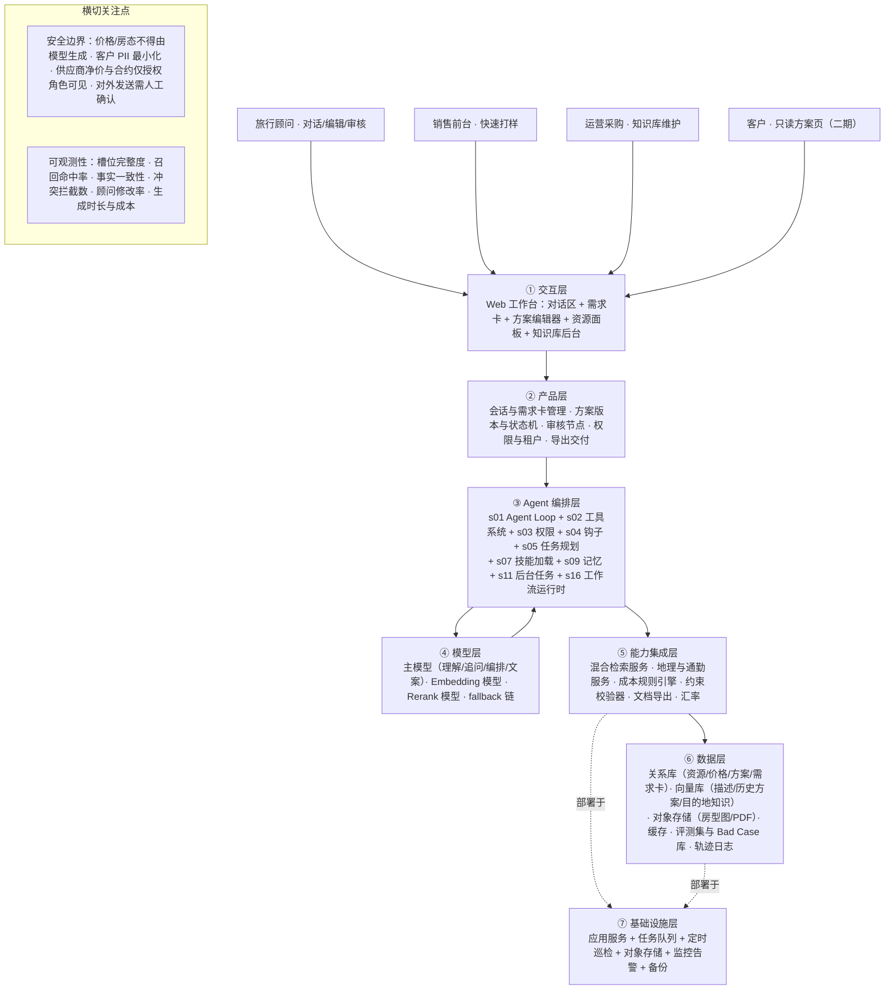
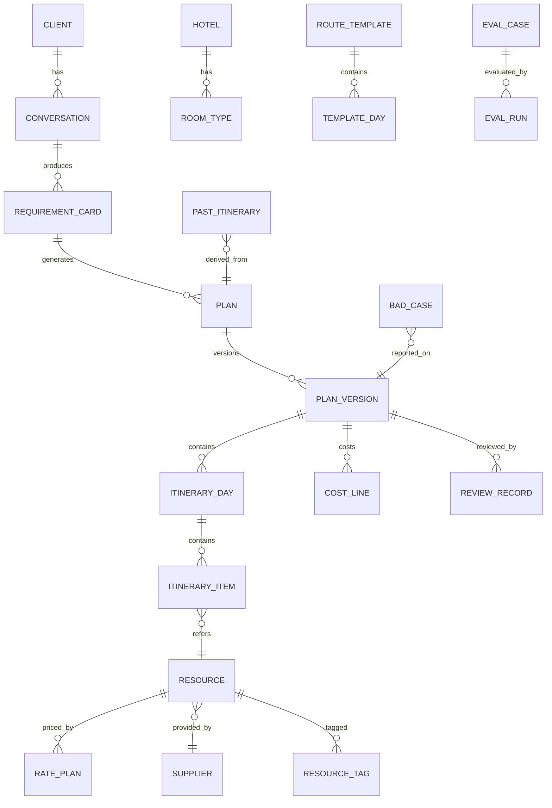

# 产品需求文档（PRD）——「行策 · BDT AI Travel Bot」

> 文档状态：方案初稿（待业务方确认第 14 章「待确认清单」后进入 MVP 开发）
> 项目代号：travel-plan-studio（高端旅行智能方案生成平台）
> 文档版本：v1.0
> 撰写日期：2026-09-06
> 需求来源：BDT 日本及海外高端定制游业务 · 旅行顾问方案生产链路数字化
> 说明：文中所有量化指标（周期、准确率、召回率等）均为**目标值假设**，需业务方用真实基线校准，已在第 14 章统一列出。

---

## 目录

1. [产品概述](#1-产品概述)
2. [目标用户与使用场景](#2-目标用户与使用场景)
3. [业务流程与问题诊断](#3-业务流程与问题诊断)
4. [术语定义](#4-术语定义)
5. [产品范围与演进路线](#5-产品范围与演进路线)
6. [系统架构](#6-系统架构)
7. [功能需求详述](#7-功能需求详述)
8. [多轮对话与信息槽位设计](#8-多轮对话与信息槽位设计)
9. [旅行知识库设计](#9-旅行知识库设计)
10. [行程生成与推荐逻辑](#10-行程生成与推荐逻辑)
11. [数据模型](#11-数据模型)
12. [交互与界面规范](#12-交互与界面规范)
13. [非功能需求](#13-非功能需求)
14. [评测体系与迭代机制](#14-评测体系与迭代机制)
15. [验收标准](#15-验收标准)
16. [风险与待确认清单](#16-风险与待确认清单)
17. [附录：Agent 组件选型与实现清单](#17-附录agent-组件选型与实现清单)

---

## 1. 产品概述

### 1.1 一句话定位

**「行策」是面向高端旅行顾问的 AI 行程规划与产品推荐工作台**——顾问或客户用自然语言说出需求，系统通过多轮对话补齐关键条件，从 BDT 自有的酒店/房型/包车/餐厅/门票/历史方案知识库中检索真实资源，生成**可解释、可编辑、带成本结构**的按天行程与产品套餐，最后由顾问审核确认后出稿。

### 1.2 产品背景与要解决的问题

| 痛点 | 现状问题 | 本产品解法 |
|---|---|---|
| 需求信息不完整 | 顾问访谈靠经验提问，常漏问预算口径、房型、饮食禁忌、纪念日，做到一半才发现返工 | 结构化**信息槽位 + 追问策略**，缺失/冲突/模糊三类问题主动澄清，需求卡随时可见 |
| 资料分散 | 酒店合约在 Excel、房型图在网盘、餐厅信息在微信群、历史方案在个人电脑 | 统一**旅行知识库**：字段标准 + 标签体系 + 版本与更新机制 |
| 资源匹配依赖个人经验 | 谁做过京都谁才知道哪家旅馆适合带儿童、哪台车能进窄巷 | 资源结构化属性 + **约束求解式推荐**，把老顾问的隐性规则显性化为可维护规则集 |
| 方案反复修改 | 客户一句"预算再降 20%"就要重排全程，手工重算成本 | **可编辑方案 + 增量重排**：锁定客户满意的部分，只重排受影响项，成本实时重算 |
| 信息更新困难 | 酒店涨价、餐厅歇业、景点休馆没人同步，方案发出去才被打脸 | 资源**时效字段 + 过期预警 + 人工复核节点**，价格与可用性不由 AI 编造 |
| 交付周期长 | 一份完整方案从需求到初稿耗时长、依赖特定顾问 | 目标：初稿从"小时级"压到"分钟级"，顾问角色从"拼装"转为"审核与增值" |

### 1.3 产品形态

- **Web 工作台**（内部系统优先，顾问为主要操作者），响应式支持平板。
- **主界面**：左侧对话区（需求采集） + 中间需求卡与方案编辑器（按天时间轴） + 右侧资源检索与推荐面板。
- **可选前台**：客户侧只读方案预览页（分享链接），二期开放客户自助填需求入口。
- **AI 定位**：AI 负责**理解、检索、编排、解释**；**价格、库存可用性、最终报价、对外发送**四类动作强制人工确认。

### 1.4 核心闭环

```
自然语言需求 → 槽位抽取与追问补全 → 结构化需求卡（顾问确认）
   → 知识库混合检索（结构化过滤 + 语义召回）
   → 约束求解式行程编排（地理/时间/预算/偏好）
   → 按天行程 + 产品推荐 + 成本结构（带引用来源）
   → 顾问编辑与锁定 → 人工审核价格与可用性 → 报价单/方案交付
   → 客户反馈 → 增量重排 → 成交方案回流为历史方案资产
```

---

## 2. 目标用户与使用场景

### 2.1 用户画像

| 画像 | 特征 | 核心诉求 | 系统对其价值 |
|---|---|---|---|
| **资深旅行顾问** | 5 年以上高端定制经验，手里有老客户，最烦重复劳动 | 少做拼装、多做增值；不能被 AI 带错 | 初稿自动化 + 全部资源可追溯，敢用 |
| **新人旅行顾问** | 入职 1 年内，不熟资源，问老同事被嫌烦 | 快速做出"不外行"的方案 | 把隐性经验变成可用的推荐与约束提示 |
| **销售/客服前台** | 接第一手需求，不做方案设计 | 快速给客户一个像样的初步构想 | 对话式采集 + 概念级方案预览 |
| **产品/采购运营** | 维护酒店合约、供应商、车队、餐厅资源 | 资料好维护、改一次全局生效 | 知识库后台 + 过期预警 + 变更影响面提示 |
| **高净值定制游客户**（间接用户，二期直连） | 时间少、要求高、决策看细节 | 方案专业、有理由、改得快 | 只读方案页 + 可解释推荐理由 |

### 2.2 典型使用场景

1. **常规询单（主场景）**：顾问把客户微信里的一段话粘进对话框——"两大一小去日本，10 月中旬，7 天，想住好点的酒店，小孩 5 岁，预算 15 万人民币左右"。系统识别出已知槽位、追问缺失项（具体日期、是否含机票、城市偏好、房型、饮食禁忌），生成结构化需求卡 → 一键生成 7 天行程初稿（东京 3 晚 + 箱根 1 晚 + 京都 3 晚，含包车、亲子友好餐厅、儿童可入住房型）→ 顾问改 2 处 → 出报价单。
2. **模糊需求打样**：客户只说"想去日本看红叶，人少一点的地方"。系统按季节知识 + 小众目的地标签给 2–3 个**方案骨架**（关西避峰版 / 东北深度版 / 中部秘境版），客户选一个再细化。
3. **预算重排**：客户回复"能不能压到 12 万"。顾问锁定"京都酒店不动"，系统给出降本路径（降级东京酒店 1 档 / 包车换新干线 / 减 1 晚），并展示每条路径的成本差与体验损失说明。
4. **资源替换**：目标旅馆当日满房。顾问在方案里点该项 → 右侧给出同区域、同档次、同价带的替代旅馆，附差异对比（温泉类型、是否有儿童政策、步行距离）。
5. **历史方案复用**：顾问搜"去年那个九州包车 6 天的家庭团" → 命中历史方案 → 一键复制为模板 → 更新日期与人数后重算价格与可用性。
6. **资源维护**：运营在后台把某酒店旺季价格上调 → 系统标出"受影响的 5 份在途方案"，提示顾问复核。

### 2.3 非目标用户（当前不服务）

- 大众散拼团、机票分销、纯 OTA 比价用户。
- 完全无人值守的对客自动成交（价格与可用性必须过人）。

---

## 3. 业务流程与问题诊断

### 3.1 传统定制游流程（AS-IS）

```
① 需求沟通（微信/电话/面谈，1–3 轮，信息口述、无结构）
   ↓
② 资源查询（酒店官网 / 供应商邮件 / Excel 合约 / 网盘房型图 / 微信问同事）
   ↓
③ 行程设计（凭经验按天排，Word/PPT 手打，反复调地理顺序与节奏）
   ↓
④ 成本核算（Excel 手工累加，房晚 × 房型 × 季节价 + 车 + 餐 + 门票 + 加价）
   ↓
⑤ 报价销售（出 PPT/PDF，发客户，客户改需求 → 回到 ②③④ 循环）
   ↓
⑥ 成交后落地（预订、确认书、行前资料）—— 本期不覆盖
```

### 3.2 各环节问题与本产品的干预点

| 环节 | 核心问题 | 耗时占比（假设） | 本产品干预 | 覆盖阶段 |
|---|---|---|---|---|
| ① 需求沟通 | 提问靠经验，信息不完整、口径不一（预算含不含机票？） | 15% | 槽位化多轮对话 + 需求卡 | MVP |
| ② 资源查询 | 资料分散在 5+ 渠道，检索靠记忆，新人无从下手 | 35% | 统一知识库 + 混合检索 | MVP |
| ③ 行程设计 | 地理/时间/节奏靠脑算，易出跨城折返、休馆日踩坑 | 25% | 约束求解式编排 + 冲突检查 | MVP |
| ④ 成本核算 | 手工 Excel，易错、改一处全表重算 | 15% | 规则引擎自动核算（价格来自库，非 AI 生成） | MVP |
| ⑤ 报价销售 | 排版耗时，反复修改无版本管理 | 10% | 方案编辑器 + 版本 + 一键导出 | MVP（导出）/ 二期（客户页） |
| ⑥ 落地执行 | 预订确认、供应商往来 | — | 不覆盖，预留接口 | 三期 |

### 3.3 TO-BE 流程与人机分工

| 步骤 | AI 负责 | 顾问负责（人工节点） | 系统卡点 |
|---|---|---|---|
| 需求采集 | 抽取槽位、识别缺失/冲突/模糊、生成追问 | 校正误解、补充客户背景 | 需求卡需顾问点"确认"才进入生成 |
| 知识检索 | 混合检索、候选打分、给出推荐理由与来源 | 判断资源是否"这个客户合适" | 检索结果必须带资源 ID 与更新时间 |
| 行程编排 | 按约束生成按天行程，标注冲突与假设 | 调顺序、换资源、锁定满意项 | 检测到硬冲突时必须提示，不静默通过 |
| 成本核算 | 调用规则引擎累加，输出成本结构 | 核对价格档、加价、汇率 | **强制人工确认**：价格与库存可用性 |
| 方案交付 | 生成文案、行程说明、推荐理由 | 终稿审核、增值建议 | **强制人工确认**：对外发送 |
| 反馈迭代 | 增量重排、给降本/升级路径 | 与客户沟通取舍 | 每版留痕，可回溯 |

> **红线**：AI 不得凭空生成价格、房态、营业时间、预约可行性；所有事实性字段必须来自知识库并携带来源与更新时间，缺失即显式标注"待人工核实"。

---

## 4. 术语定义

| 术语 | 含义 |
|---|---|
| **需求卡（Requirement Card）** | 结构化旅行需求对象，槽位的集合 + 完整度评分 + 冲突列表，是生成方案的唯一输入 |
| **槽位（Slot）** | 一条结构化需求字段（如 `budget.total`、`hotel.tier`），有取值域、必填等级、置信度、来源（客户原话/顾问填写/系统推断） |
| **完整度（Completeness）** | 必填槽位填充比例，达阈值才允许生成完整方案；未达阈值只能生成"方案骨架" |
| **资源（Resource）** | 知识库中的可售/可用实体：酒店、房型、车辆、司导、餐厅、门票体验、景点 POI、机场接送 |
| **供应商（Supplier）** | 资源的提供方，含结算方式、净价、合约有效期、预订提前期 |
| **价格档（Rate Plan）** | 资源在某时间区间、某人数结构下的价格规则（含旺季加价、儿童政策、含餐、取消政策） |
| **路线模板（Route Template）** | 经验沉淀的可复用行程骨架（如"关西经典 5 日"），含天数、城市序列、节奏标签 |
| **历史方案（Past Itinerary）** | 已交付的真实方案（含成交结果与客户反馈），既是检索语料也是推荐依据 |
| **方案（Plan）** | 一次生成结果：按天行程 + 产品推荐 + 成本结构 + 说明文案，有版本号与状态 |
| **行程项（Itinerary Item）** | 方案中某天的一个条目（住宿/交通/餐饮/景点/体验/自由时间），绑定资源 ID |
| **约束（Constraint）** | 编排时必须满足（硬约束）或尽量满足（软约束）的规则，如"同日通勤总时长 ≤ 3h" |
| **锁定（Lock）** | 顾问把某行程项或某天标为不可变，重排时保持不动 |
| **增量重排（Incremental Replan）** | 仅重排未锁定且受变更影响的部分，保留其余内容与版本谱系 |
| **可解释性（Explainability）** | 每个推荐项都能回答"为什么是它"：命中的槽位、约束、来源资源 ID |
| **混合检索（Hybrid Retrieval）** | 结构化过滤（SQL：城市/档次/价带/日期）+ 语义召回（向量：偏好描述）+ 融合重排 |
| **Bad Case** | 评测或线上发现的错误样本，归因为知识缺失/检索偏差/行程冲突/理解错误四类之一 |

---

## 5. 产品范围与演进路线

### 5.1 MVP（第一期，目标 8–10 周）

**目标**：单一目的地国（日本）+ 3 类客户场景（家庭亲子、蜜月纪念、深度文化）跑通端到端链路，让 5–8 位顾问日常可用。

| 模块 | MVP 范围 | 明确不做 |
|---|---|---|
| 多轮对话采集 | 12 个核心槽位、缺失追问、冲突提示、需求卡确认 | 语音输入、多语言（先中文） |
| 知识库 | 酒店/房型/价格档、包车与接送、餐厅、门票体验、景点 POI、路线模板、历史方案（7 类） | 机票、邮轮、保险、签证代办 |
| 检索 | 结构化过滤 + 向量召回 + 融合重排 + 来源引用 | 实时供应商 API 查价 |
| 行程生成 | 3–10 天按天行程，含住宿/交通/餐饮/景点，硬约束校验 | 多方案自动 A/B 对比、跨国多国联程 |
| 产品推荐 | 酒店房型推荐、包车方案推荐、餐厅与体验推荐 | 自动预订、库存锁定 |
| 方案编辑 | 拖拽调序、替换资源、锁定、增量重排、版本管理 | 富文本自由排版、协同多人同编 |
| 成本核算 | 规则引擎累加 + 成本结构展示 + 汇率与加价 | 佣金分成、财务对账、开票 |
| 交付 | 导出 PDF/Word 方案书 | 客户在线互动确认、电子签 |
| 评测 | 30–50 条黄金测试集 + Bad Case 库 + 人工评分后台 | 自动化在线 A/B |

### 5.2 二期（目标 +8 周）

- 客户侧只读方案页 + 客户自助需求入口（对话式表单）。
- 多方案并行对比（经济/推荐/升级三档）与降本路径自动生成。
- 供应商侧资源更新协作（供应商自助报价上传 + 审核流）。
- 知识库自动巡检：过期价格、失效链接、长期未更新资源预警。
- 评测自动化：回归跑测 + 事实一致性自动校验。

### 5.3 三期（展望）

- 多目的地（东南亚、欧洲）扩展，目的地知识模块化插拔。
- 预订执行链路（确认书、供应商单据、行前资料自动生成）。
- 从历史成交数据反推定价与转化优化建议。
- 顾问经验的持续学习：把顾问的每次修改作为偏好信号回流优化排序。

---

## 6. 系统架构

### 6.1 分层架构图



### 6.2 关键数据流（一次完整生成）

1. **输入**（①）：顾问粘贴客户原话 → ② 建会话 + 空需求卡。
2. **槽位抽取**（③→④）：主模型调用 `extract_slots`，输出槽位值 + 置信度；低置信度标记待确认。
3. **补全追问**（③）：`check_completeness` 计算完整度与冲突 → 按追问策略生成一次最多 3 问 → 顾问/客户作答 → 循环至达阈值。
4. **需求卡确认**（②）：顾问点确认，需求卡冻结为 `v1`（后续修改产生新版本）。
5. **候选检索**（③→⑤→⑥）：按需求卡拆解为多路检索任务（酒店 / 交通 / 餐厅 / 景点体验），`search_resources` 做结构化过滤 + 向量召回 + rerank，返回带来源的候选池。
6. **行程编排**（③+⑤）：`plan_itinerary` 生成按天骨架（城市序列 + 住宿分配）→ 逐日填充 → `validate_constraints` 校验地理/时间/预算/偏好 → 有硬冲突则回退重排（最多 N 轮）。
7. **成本核算**（⑤）：`calculate_cost` 从价格档读取真实价格，按人数结构、房晚、季节加价、儿童政策、包车时长规则累加，输出成本结构。**模型不参与数字生成，只做解释性描述。**
8. **产出组装**（③）：`compose_plan` 输出按天行程 + 推荐理由 + 引用来源 + 成本结构 + 待人工核实清单。
9. **人工审核**（②）：顾问编辑/锁定/替换 → 变更触发 `replan_incremental` → 价格与可用性人工确认后方案状态推进到"可交付"。
10. **交付与回流**（②→⑥）：导出 PDF；成交方案写入历史方案库并生成向量索引；每步轨迹写入日志用于评测与迭代。

### 6.3 检索架构（RAG 设计要点）

| 层次 | 内容 | 说明 |
|---|---|---|
| **结构化层（硬过滤）** | 城市、日期可用性、星级/档次、价带、房型容量、儿童政策、车辆座位数、餐厅营业日、景点休馆日 | 走关系库 SQL，**不可协商**——过滤掉的资源绝不进入候选 |
| **语义层（软召回）** | 资源描述、体验氛围、历史方案文本、目的地知识、顾问点评 | 走向量检索，解决"想要安静有格调的温泉旅馆"这类模糊表达 |
| **融合重排** | 结构化匹配分 × 权重 + 语义相似度 × 权重 + 业务优先级（合约优先、毛利、库存充裕度）+ 历史成交表现 | 权重可配置，运营可调，调整需记录 |
| **引用与降级** | 每个候选返回 `resource_id / 更新时间 / 数据来源`；语义层无结果时降级为结构化 Top-N + 显式提示"无精准匹配" | 宁可返回少而准，不做补全式编造 |

---

## 7. 功能需求详述

> 优先级：**P0** = MVP 必须；**P1** = MVP 期望；**P2** = 二期。

### 7.1 F1 会话与需求采集（P0）

| 编号 | 需求 | 验收要点 |
|---|---|---|
| F1-1 | 支持自由文本输入（含长段粘贴、多条消息累积）建立会话 | 一段 200 字客户原话可一次抽出 ≥5 个槽位 |
| F1-2 | 槽位抽取结果实时映射到右侧需求卡，逐项显示来源与置信度 | 每个槽位标注「客户原话/顾问填写/系统推断」 |
| F1-3 | 缺失必填槽位时生成追问，单轮最多 3 问，按优先级排序 | 不重复追问已确认槽位；追问自然、不像表单 |
| F1-4 | 识别需求冲突（如预算 vs 酒店档次）并显式提示，给取舍建议 | 冲突提示含数字依据（"该档次 7 晚约 X 万，占预算 Y%"） |
| F1-5 | 识别模糊表达并给可选项（"住好点的"→ 4 星/5 星/奢华/温泉旅馆） | 提供选项而非追问开放式问题 |
| F1-6 | 需求卡支持顾问直接编辑任一槽位、覆盖 AI 抽取结果 | 顾问修改优先级高于模型抽取，且被记为偏好信号 |
| F1-7 | 完整度评分与"可生成"门槛提示；未达门槛可生成"方案骨架" | 完整度 <阈值时按钮态为"生成骨架" |
| F1-8 | 会话可保存、恢复、多轮跨天继续 | 关闭浏览器 24h 后恢复上下文一致 |
| F1-9 | 客户自助需求入口（对话式表单，无价格可见） | P2 |

### 7.2 F2 知识检索（P0）

| 编号 | 需求 | 验收要点 |
|---|---|---|
| F2-1 | 按需求卡自动执行多路检索（住宿/交通/餐饮/景点体验） | 一次生成触发的检索任务可在轨迹中查看 |
| F2-2 | 顾问可手动检索资源库（关键词 + 多维筛选） | 筛选维度覆盖城市、档次、价带、标签、供应商、更新时间 |
| F2-3 | 每条结果展示关键结构化字段 + 更新时间 + 数据来源 | 超过设定时效的价格显示"价格待核实"角标 |
| F2-4 | 检索结果可直接拖入方案指定日期 | 拖入后自动触发约束校验与成本重算 |
| F2-5 | 无匹配结果时给出放宽建议（放宽哪个条件能得到几个结果） | 不返回空白页 |
| F2-6 | 历史方案检索（按目的地/天数/人数/预算/客户类型/成交状态） | 可一键"复制为模板" |

### 7.3 F3 行程生成（P0）

| 编号 | 需求 | 验收要点 |
|---|---|---|
| F3-1 | 生成 3–10 天按天行程，每天含时间段化条目（上午/午餐/下午/晚餐/夜间/住宿） | 结构完整，无空日、无孤立条目 |
| F3-2 | 城市序列与住宿分配符合地理合理性（减少折返、连住优先） | 不出现同日跨两城以上（除必要转场日） |
| F3-3 | 每个条目附推荐理由（命中的偏好/约束/来源） | 鼠标悬停即可见理由与 `resource_id` |
| F3-4 | 硬约束违规必须拦截或显式警示，不静默通过 | 见 10.2 约束清单，逐条可被测试 |
| F3-5 | 生成结果携带"假设与待核实清单" | 如"该旅馆价格更新于 X 日期，需向供应商复核" |
| F3-6 | 生成骨架模式（完整度不足时）：只给城市序列 + 节奏 + 档次建议 | 骨架不含具体价格 |
| F3-7 | 多方案并行（经济/推荐/升级三档） | P2 |
| F3-8 | 生成过程可视化（正在检索/编排/核算），支持中断 | 长任务走后台，前端可轮询进度 |

### 7.4 F4 产品推荐（P0）

| 编号 | 需求 | 验收要点 |
|---|---|---|
| F4-1 | 酒店推荐给出 2–3 个同档候选，含差异对比（位置、房型、含餐、儿童政策） | 对比维度结构化，非纯文本 |
| F4-2 | 房型推荐匹配人数结构（含儿童年龄、加床、连通房需求） | 人数容量不匹配的房型不得出现 |
| F4-3 | 包车/接送推荐匹配人数 + 行李 + 路线（含车型座位与行李容量校验） | 6 人 6 箱行李不得推 5 座车 |
| F4-4 | 餐厅推荐匹配饮食禁忌、预算档、营业日、预约提前期、与当日行程地理位置 | 命中禁忌的餐厅零出现（硬约束） |
| F4-5 | 门票与体验推荐匹配休馆日、体力强度、儿童/长者适宜性 | 周一休馆的馆不得排在周一 |
| F4-6 | 替换建议：任一条目可一键"看替代方案" | 替代项保持同档同价带，展示差异说明 |

### 7.5 F5 方案编辑与版本（P0）

| 编号 | 需求 | 验收要点 |
|---|---|---|
| F5-1 | 按天时间轴视图，条目支持拖拽调序、跨日移动、删除、新增 | 操作后立即校验并提示冲突 |
| F5-2 | 条目/整日锁定，重排时保持不动 | 锁定项在重排后逐字节一致 |
| F5-3 | 增量重排：变更只影响未锁定且受影响的范围 | 变更 1 天不应导致其余天数被无理由改写 |
| F5-4 | 版本管理：每次生成/重排产生新版本，可对比、可回滚 | 版本 diff 可视化（新增/删除/替换/价格变化） |
| F5-5 | 方案状态机：草稿 → 待审核 → 已审核 → 已交付 → 已成交/已放弃 | 状态推进的权限与卡点见 7.6 |
| F5-6 | 方案备注与内部批注（不对客可见） | 导出时不含内部批注 |

### 7.6 F6 成本核算与人工审核（P0）

| 编号 | 需求 | 验收要点 |
|---|---|---|
| F6-1 | 成本结构自动核算：住宿 / 交通 / 餐饮 / 门票体验 / 司导 / 服务费 / 税 | 每项可下钻到计算明细（单价 × 数量 × 规则） |
| F6-2 | 价格一律取自价格档，模型不得生成或修改数字 | 代码层面隔离：模型输出不含金额字段 |
| F6-3 | 支持币种与汇率（净价币种 → 报价币种），汇率来源与时间可见 | 汇率变动不自动改历史版本 |
| F6-4 | 儿童政策、加床、旺季加价、包车超时费按规则计算 | 规则可配置，变更留痕 |
| F6-5 | **人工确认节点（强制）**：价格与库存可用性 —— 未确认不得推进到"已审核" | 未确认时导出按钮禁用，提示原因 |
| F6-6 | **人工确认节点（强制）**：对外发送/导出 —— 需操作者显式确认 | 二次确认弹窗，记录操作人与时间 |
| F6-7 | 预算达成度展示（总价 vs 客户预算，超支时高亮并给降本路径） | 超支 >5% 必须提示 |
| F6-8 | 毛利与净价视图，仅授权角色可见 | 前台角色不可见净价 |

### 7.7 F7 知识库后台（P0）

| 编号 | 需求 | 验收要点 |
|---|---|---|
| F7-1 | 7 类资源的增删改查，字段遵循第 9 章字段标准 | 必填字段缺失不得保存 |
| F7-2 | 批量导入（Excel/CSV 模板）+ 校验报告（哪行哪字段不合规） | 导入不静默丢数据 |
| F7-3 | 标签体系维护（受控词表，禁止自由造词） | 新标签需审核后生效 |
| F7-4 | 时效管理：`valid_from/valid_to`、`updated_at`、过期与临期预警 | 临期资源在检索结果中带角标 |
| F7-5 | 变更影响面提示：改动某资源时列出引用它的在途方案 | 列表可点击跳转 |
| F7-6 | 房型图/资料附件上传与关联 | 附件可在方案与推荐中引用 |
| F7-7 | 变更审计日志（谁在何时改了什么） | 可按资源与操作人检索 |
| F7-8 | 供应商自助报价上传与审核流 | P2 |

### 7.8 F8 交付输出（P0/P1）

| 编号 | 需求 | 验收要点 |
|---|---|---|
| F8-1 | 导出对客方案书（PDF），含封面、按天行程、酒店与房型说明、含/不含项、报价、条款 | 排版稳定，不出现空字段占位符 |
| F8-2 | 导出内部核算表（Excel），含成本明细与供应商 | 仅授权角色 |
| F8-3 | 方案文案由模型生成（行程描述、亮点说明），事实字段来自库 | 文案不得引入库外事实 |
| F8-4 | 客户在线只读方案页（分享链接 + 有效期 + 可选口令） | P2 |

### 7.9 F9 评测与运营后台（P0）

| 编号 | 需求 | 验收要点 |
|---|---|---|
| F9-1 | 黄金测试集管理（用例：输入 + 期望要点 + 评分维度） | 支持 30+ 用例批量跑测 |
| F9-2 | 人工评分入口（5 维度打分 + 备注） | 见第 14 章维度定义 |
| F9-3 | Bad Case 记录与归因分类（知识缺失/检索偏差/行程冲突/理解错误） | 一键从任意方案标记为 Bad Case |
| F9-4 | 指标看板：完整度、召回命中率、事实准确率、冲突拦截数、顾问修改率、生成时长与 token 成本 | 按周对比 |
| F9-5 | 轨迹回放：查看某次生成的全过程（槽位→检索→编排→核算） | 可复现问题定位 |

### 7.10 F10 权限与账户（P0）

| 角色 | 会话与生成 | 方案编辑 | 净价/毛利 | 知识库维护 | 审核推进 | 评测后台 |
|---|---|---|---|---|---|---|
| 销售前台 | ✅ | 仅草稿 | ❌ | ❌ | ❌ | ❌ |
| 旅行顾问 | ✅ | ✅ | ✅（本人方案） | ❌ | ✅ | 只读 |
| 资深顾问/主管 | ✅ | ✅（全部） | ✅ | ❌ | ✅ | ✅ |
| 运营采购 | 只读 | ❌ | ✅ | ✅ | ❌ | ✅ |
| 管理员 | ✅ | ✅ | ✅ | ✅ | ✅ | ✅ |

---

## 8. 多轮对话与信息槽位设计

### 8.1 槽位清单

**必填（P0，缺失阻塞完整方案生成）**

| 槽位 | 取值域 | 说明 | 追问优先级 |
|---|---|---|---|
| `destination.countries` / `destination.cities` | 受控词表（国家/城市） | 支持"日本"这种粗粒度，后续细化 | 1 |
| `dates.mode` | 确定日期 / 大致月份 / 弹性 | 决定后续可用性校验强度 | 2 |
| `dates.start` / `dates.end` / `duration_days` | 日期 / 整数 | 三者可互推，至少给两个 | 2 |
| `pax.adults` / `pax.children` / `pax.child_ages` / `pax.seniors` | 整数 / 年龄数组 | 儿童年龄直接影响房型与门票 | 3 |
| `budget.amount` / `budget.currency` / `budget.basis` | 数值 / 币种 / 总价·人均 | **必须问清口径** | 4 |
| `budget.includes_flight` | 是 / 否 / 未定 | 高频误解来源 | 4 |
| `hotel.tier` | 4星 / 5星 / 奢华 / 温泉旅馆 / 设计精品 / 混合 | 支持按城市分档 | 5 |

**重要（P0，缺失可用默认值但需标注）**

| 槽位 | 取值域 | 默认策略 |
|---|---|---|
| `hotel.room_config` | 房型 + 间数（大床/双床/家庭房/连通房/和室/带私汤） | 按人数结构推断，标注"系统推断" |
| `interests` | 多选标签：美食 / 文化历史 / 亲子 / 购物 / 自然风光 / 温泉 / 滑雪 / 摄影 / 艺术设计 / 动漫 / 高尔夫 / 婚旅纪念 | 空则按目的地经典款 |
| `pace` | 轻松 / 适中 / 紧凑 | 默认适中；有儿童或长者时默认轻松 |
| `transport.preference` | 全程包车 / 包车+新干线 / 公共交通 / 自驾 | 按人数与目的地推断 |
| `dietary.restrictions` | 无 / 素食 / 清真 / 无猪肉 / 过敏项 / 忌生食 | 空则显式确认一次（**不可静默假设为无**） |
| `special.occasion` | 无 / 生日 / 蜜月 / 纪念日 / 求婚 / 毕业 | 影响升级与惊喜安排 |
| `accessibility` | 无 / 婴儿车 / 轮椅 / 行走不便 / 需电梯 | 影响景点与酒店筛选 |

**可选（P1）**

`language.guide`（导游语言）、`flight.status`（已订/待订/航班号）、`visa.status`、`previous_visits`（去过哪些城市，避免重复）、`must_have`（客户点名要的酒店/餐厅/体验）、`must_avoid`、`shopping.budget`、`insurance`、`client.profile`（客户画像备注）。

### 8.2 追问策略

| 规则 | 内容 |
|---|---|
| **单轮上限** | 一次最多 3 个问题，避免问卷感 |
| **优先级排序** | 必填 > 高影响（预算口径、饮食禁忌、儿童年龄）> 重要 > 可选 |
| **合并提问** | 语义相关的槽位合并成一句自然表达（如日期 + 天数 + 弹性度） |
| **给选项优先** | 能给枚举就不问开放题（"住好点的"→ 给 4 个档次选项 + 各档大致人均） |
| **推断可见** | 能推断的先填并标"系统推断"，只请确认不重问（如 2 大 1 小 → 家庭房 1 间） |
| **不追问已知** | 已确认槽位不再问；顾问覆盖过的值不被模型改写 |
| **禁止静默默认** | 饮食禁忌、无障碍、预算口径三项**必须显式确认一次** |
| **止损** | 同一槽位追问 ≤2 次；仍无法获得则标记"待客户确认"并按标注默认值继续 |

### 8.3 三类需求问题的识别与处理

| 类型 | 判定方式 | 处理动作 | 示例 |
|---|---|---|---|
| **缺失** | 必填槽位为空 | 生成追问，按优先级 | 没说预算 → "预算大概什么范围？是含机票的总预算还是地面部分？" |
| **冲突** | 触发预置冲突规则（见下表） | 显式提示 + 给 2–3 条取舍路径 + 数字依据 | 预算 8 万 / 4 人 / 5 星 / 10 天 → 提示预算与档次天数不匹配 |
| **模糊** | 表达无法映射到取值域，或映射置信度低于阈值 | 给枚举选项，不问开放题 | "小众一点的地方" → 给 3 个小众度不同的目的地组合 |

**预置冲突规则（MVP 至少覆盖这些）**

| 冲突 | 判定 | 提示与建议 |
|---|---|---|
| 预算 vs 档次 | 按档次均价 × 房晚 × 间数 > 预算的住宿合理占比 | 给"降档 / 减天数 / 提预算"三条路径与差额 |
| 天数 vs 城市数 | 城市数 > `floor(天数/2)` | 建议减城市或加天数，说明转场损耗 |
| 儿童/长者 vs 节奏 | 有 ≤6 岁儿童或长者且 `pace=紧凑` | 建议降为轻松，说明每日步行与车程 |
| 无障碍 vs 目的地 | 需轮椅但含高台阶/山地景点 | 替换为无障碍友好替代项 |
| 季节 vs 目的地 | 樱花/红叶/滑雪季与日期不匹配 | 告知实际可见概率与替代目的地 |
| 旺季 vs 档次可用性 | 黄金周/盂兰盆/樱花季 + 奢华档 | 提示需尽早锁房，价格上浮区间 |
| 名店预约 vs 提前期 | `must_have` 含需长提前期的餐厅/体验，距出行日不足 | 提示预约概率低，给替代 |
| 房型 vs 人数 | 人数结构无法被所选房型容纳 | 给可行房型组合 |

---

## 9. 旅行知识库设计

### 9.1 知识分类（7 类核心实体 + 2 类支撑）

| 类别 | 实体 | 用途 | 更新频率 |
|---|---|---|---|
| 住宿 | 酒店、房型、价格档 | 住宿推荐与核算 | 房态月级、价格季度级 |
| 交通 | 包车车型、司导、接送机产品、城际交通（新干线/特急） | 交通编排与核算 | 季度级 |
| 餐饮 | 餐厅（含营业日、预约提前期、人均、菜系、禁忌适配） | 餐饮推荐 | 季度级 |
| 门票与体验 | 景点门票、体验活动（茶道/和服/滑雪/游船等） | 白天内容编排 | 季度级 |
| 地理 | 景点 POI、区域、通勤矩阵 | 地理合理性与通勤时长 | 半年级 |
| 经验 | 路线模板、历史方案 | 骨架复用与相似推荐 | 持续沉淀 |
| 目的地知识 | 季节与节庆、休馆规律、着装与礼仪、避坑提示 | 约束与文案 | 半年级 |
| 支撑 | 供应商与合约 | 净价、结算、提前期 | 合约周期 |
| 支撑 | 标签词表 | 全库统一语义 | 按需审核 |

### 9.2 字段标准（示例：酒店 / 房型 / 价格档）

**酒店（Hotel）**

| 字段 | 类型 | 必填 | 说明 |
|---|---|---|---|
| `hotel_id` | string | ✅ | 全局唯一 |
| `name_zh` / `name_local` / `name_en` | string | ✅/✅/— | 中文名必填，便于顾问检索 |
| `country` / `city` / `district` | 受控词表 | ✅ | 三级地理 |
| `geo` | {lat,lng} | ✅ | 用于地理聚类与通勤计算 |
| `tier` | 枚举 | ✅ | 4星/5星/奢华/温泉旅馆/设计精品/民宿 |
| `category` | 枚举 | ✅ | 城市酒店 / 度假酒店 / 温泉旅馆 / 精品 |
| `tags` | 受控标签数组 | ✅ | 亲子友好 / 蜜月 / 有私汤 / 近车站 / 有中文服务 / 可婴儿床… |
| `child_policy` | 结构化 | ✅ | 可入住年龄、免费年龄、加床规则、儿童餐 |
| `facilities` | 数组 | — | 泳池、健身、SPA、餐厅、无障碍 |
| `distance_to` | 数组 | — | 到主要车站/机场/地标的距离与时长 |
| `supplier_ids` | 数组 | ✅ | 关联供应商 |
| `advisor_notes` | text | — | 顾问经验（隐性知识显性化的关键字段） |
| `photos` | 附件 | — | 对象存储引用 |
| `status` | 枚举 | ✅ | 启用 / 停用 / 待核实 |
| `updated_at` / `updated_by` | 时间/用户 | ✅ | 时效与审计 |

**房型（RoomType）**

| 字段 | 类型 | 必填 | 说明 |
|---|---|---|---|
| `room_id` / `hotel_id` | string | ✅ | 归属酒店 |
| `name_zh` / `name_local` | string | ✅ | |
| `bed_config` | 结构化 | ✅ | 床型 × 数量（大床/双床/榻榻米） |
| `max_occupancy` / `max_adults` / `max_children` | int | ✅ | **硬约束依据** |
| `extra_bed` | 结构化 | ✅ | 是否可加床、费用、年龄限制 |
| `size_sqm` / `view` / `smoking` | 数值/枚举 | — | |
| `features` | 受控标签 | — | 私汤 / 连通房 / 无障碍 / 客厅分离 |
| `updated_at` | 时间 | ✅ | |

**价格档（RatePlan）**

| 字段 | 类型 | 必填 | 说明 |
|---|---|---|---|
| `rate_id` / `resource_type` / `resource_id` | string | ✅ | 可挂在房型/车辆/门票等任意资源 |
| `supplier_id` | string | ✅ | |
| `valid_from` / `valid_to` | date | ✅ | 时间区间 |
| `applicable_dow` / `blackout_dates` | 数组 | — | 适用星期、不可用日期 |
| `net_price` / `currency` | 数值/枚举 | ✅ | **净价，权限受控** |
| `price_basis` | 枚举 | ✅ | 每间夜 / 每人 / 每车天 / 每次 |
| `meal_plan` | 枚举 | — | 不含餐 / 含早 / 半食宿 / 全食宿（旅馆一泊二食） |
| `season_type` | 枚举 | ✅ | 平季 / 旺季 / 特旺（黄金周·盂兰盆·跨年·樱花红叶） |
| `child_pricing` | 结构化 | — | 分年龄段价格规则 |
| `cancellation_policy` | text/结构化 | ✅ | 取消政策 |
| `booking_lead_time_days` | int | — | 预订提前期 |
| `markup_rule_id` | string | — | 关联加价规则 |
| `confidence` | 枚举 | ✅ | 已确认合约价 / 参考价 / 历史价（**驱动"待核实"角标**） |
| `updated_at` | 时间 | ✅ | |

> 其余实体（车辆与包车、餐厅、门票体验、POI、路线模板、历史方案、供应商）字段标准同构，统一遵循四条铁律：**① 地理必带经纬 ② 价格必带时效与来源置信度 ③ 容量/适宜性必结构化（不可只写在描述里）④ 必带 `updated_at` 与 `status`**。

### 9.3 标签体系

采用**受控词表 + 分面（facet）**，禁止自由造词，新标签走审核。

| 分面 | 示例标签 | 主要作用 |
|---|---|---|
| 客群 | 亲子 / 蜜月 / 长者友好 / 团建 / 单人 / 大家庭 | 匹配人数结构与场合 |
| 主题 | 美食 / 文化历史 / 自然 / 温泉 / 滑雪 / 购物 / 艺术设计 / 动漫 / 摄影 | 匹配兴趣槽位 |
| 体验强度 | 轻松 / 适中 / 需体力 / 高强度 | 匹配节奏与体力约束 |
| 服务 | 中文服务 / 英文服务 / 可婴儿床 / 无障碍 / 宠物友好 | 匹配特殊需求 |
| 季节适宜 | 春樱 / 夏祭 / 秋叶 / 冬雪 / 全年 | 季节匹配 |
| 位置属性 | 近车站 / 市中心 / 郊外静谧 / 海景 / 山景 | 地理与氛围 |
| 内部运营 | 主推 / 合约优先 / 高毛利 / 慎推（附原因） | 排序权重与风险控制 |

### 9.4 更新机制

| 机制 | 内容 |
|---|---|
| **责任人制** | 每类资源指定 owner，字段级审计（谁改了什么） |
| **时效驱动** | `updated_at` 超阈值（价格 90 天 / 一般资源 180 天，待确认）→ 进入待复核队列，检索结果打角标 |
| **临期预警** | 合约或价格档 `valid_to` 临近 30 天 → 通知 owner |
| **影响面联动** | 资源变更时列出引用它的在途方案，通知对应顾问 |
| **成交回流** | 方案成交后自动生成历史方案记录（脱敏客户信息），并写入向量索引 |
| **Bad Case 回流** | 归因为"知识缺失"的 Bad Case 自动生成知识库补录工单 |
| **导入校验** | Excel 批量导入必须过字段校验，输出不合规行报告，不静默丢数据 |

---

## 10. 行程生成与推荐逻辑

### 10.1 生成流程（三阶段）

```
阶段一 · 骨架规划
  输入：需求卡（目的地、天数、节奏、兴趣、预算）
  输出：城市序列 + 每城住宿晚数 + 转场日 + 每日主题
  依据：路线模板库匹配 → 相似历史方案 → 地理与交通可行性
  约束：连住优先、减少折返、转场日不安排高强度内容

阶段二 · 逐日填充
  输入：骨架 + 各资源候选池
  输出：每天的住宿/交通/餐饮/景点体验条目（含时间段）
  依据：地理聚类（同日条目就近）→ 营业时间与休馆日 → 兴趣匹配 → 预算分配
  约束：见 10.2

阶段三 · 校验与核算
  硬约束校验 → 违规回退重排（≤N 轮）→ 仍违规则显式标注并交人工
  成本核算（规则引擎）→ 预算达成度 → 组装推荐理由与来源引用
```

### 10.2 约束清单

**硬约束（违反必须拦截或显式警示，不得静默通过）**

| 编号 | 约束 | 判定依据 |
|---|---|---|
| H1 | 房型容量必须容纳实际人数结构 | `max_occupancy` / `max_children` / 加床规则 |
| H2 | 饮食禁忌不得被违反 | 餐厅 `dietary_support` 字段 |
| H3 | 景点/餐厅在当日必须营业（含休馆日、周期性休业、节假日闭馆） | `opening_hours` / `closed_days` / `blackout_dates` |
| H4 | 车辆座位数与行李容量必须满足 | `seats` / `luggage_capacity` |
| H5 | 同日通勤总时长不超过上限（默认 3h，转场日 5h，待确认） | 通勤矩阵 |
| H6 | 转场日不得跨越 2 个以上城市 | 城市序列 |
| H7 | 酒店入住/退房时间与当日抵离时间兼容 | `checkin_time` / 航班或车次时间 |
| H8 | 资源在出行日期区间内可售（合约有效、未 blackout） | `valid_from/to` |
| H9 | 无障碍需求下不得排入不适配景点或酒店 | `accessibility` 标签 |
| H10 | 总价不得无提示地超出客户预算 | 成本核算 vs `budget` |
| H11 | 价格与房态必须来自知识库；无数据则标"待核实"而非推测 | `confidence` 字段 |

**软约束（尽量满足，违反需说明）**

| 编号 | 约束 | 说明 |
|---|---|---|
| S1 | 兴趣覆盖度：每个声明兴趣至少 1 个对应条目 | 优先级按兴趣顺序 |
| S2 | 预算结构合理：住宿/交通/餐饮/体验占比落在经验区间 | 区间可配置 |
| S3 | 节奏合理：每日景点数与步行量匹配 `pace` 与人群 | 有儿童/长者时收紧 |
| S4 | 体验多样性：同类型体验不连续重复 | 避免连续三天寺庙 |
| S5 | 避免重复：`previous_visits` 中的城市/景点降权 | |
| S6 | 高光分布：亮点体验分散在行程中，首末日不空洞 | |
| S7 | 餐饮档次与酒店档次匹配 | 避免奢华酒店配路边小店（除客户明确要求） |
| S8 | 名店预约提前期可行 | 不可行则降权并提示 |
| S9 | 商务优先级：合约优先与主推资源适度加权 | 不得压倒硬约束与适配度 |

### 10.3 推荐排序公式（可配置）

```
score = w1 · 结构化匹配度（档次/价带/容量/位置/标签命中）
      + w2 · 语义相似度（偏好描述 ↔ 资源描述/顾问点评）
      + w3 · 历史表现（相似客户的采纳率与成交率）
      + w4 · 商务优先级（合约优先/毛利/库存充裕度）
      - p1 · 时效惩罚（价格或资源过期程度）
      - p2 · 风险惩罚（慎推标记、预约难度、临期合约）
```

初始权重建议 `w1=0.4, w2=0.25, w3=0.15, w4=0.1, p1/p2` 按档惩罚；**权重与惩罚项全部落在配置中，由运营调整并留痕**，模型不参与权重决定。

### 10.4 增量重排规则

| 触发 | 重排范围 | 保持不变 |
|---|---|---|
| 替换某条目 | 该条目 + 同日地理受影响条目 | 其他天、所有锁定项 |
| 修改某日 | 该日 + 相邻转场衔接 | 其他天、锁定项 |
| 调整预算 | 未锁定条目按降本路径调整 | 锁定项（若锁定项已超预算，显式提示不可达） |
| 修改人数/日期 | 全量重算可用性与价格，行程结构尽量保留 | 结构与锁定项优先保留，冲突项标红 |

### 10.5 输出结构（按天行程）

```yaml
plan:
  plan_id, requirement_card_version, plan_version, status
  summary: {title, highlights[], total_days, cities[], pace}
  days:
    - day_index, date, city, theme, transfer: bool
      items:
        - slot: morning|lunch|afternoon|dinner|evening|accommodation|transport
          type: hotel|room|restaurant|attraction|experience|transfer|free_time
          resource_id, resource_name, duration_min, start_time?, end_time?
          reason: {matched_slots[], matched_constraints[], template_or_case_ref?}
          source: {data_source, updated_at, confidence}
          cost_ref: rate_id | null
          flags: [needs_verification, tight_schedule, budget_risk, ...]
      day_notes: [通勤提示 / 天气与着装 / 预约提醒]
  cost:
    breakdown: {accommodation, transport, dining, tickets_experiences, guide, service_fee, tax}
    currency, fx_rate, fx_time
    total, per_person, budget_target, variance_pct
  verification_checklist: [待人工核实项]
  assumptions: [系统推断项及依据]
  unmet: [未满足的软约束及原因]
```

---

## 11. 数据模型

### 11.1 实体关系（简化）



### 11.2 核心表说明

| 表 | 关键字段 | 说明 |
|---|---|---|
| `conversation` | id, client_id, advisor_id, status, created_at | 一次询单会话 |
| `message` | id, conversation_id, role, content, extracted_slots, created_at | 对话留痕，供评测回放 |
| `requirement_card` | id, conversation_id, version, slots(jsonb), completeness, conflicts(jsonb), confirmed_by, confirmed_at | 生成方案的唯一输入，版本化 |
| `plan` | id, requirement_card_id, current_version, status, owner_id | 方案主体与状态机 |
| `plan_version` | id, plan_id, version, structure(jsonb), cost_summary, generated_by, parent_version | 版本谱系，支持 diff 与回滚 |
| `itinerary_day` / `itinerary_item` | 见 10.5 | 可关系化落库便于查询与校验 |
| `resource` | id, type, city, geo, tier, tags, status, updated_at, updated_by | 资源统一表 + 分类型扩展表 |
| `hotel` / `room_type` / `vehicle` / `restaurant` / `ticket_experience` / `poi` | 见 9.2 | 类型扩展表 |
| `rate_plan` | 见 9.2 | 价格唯一来源 |
| `supplier` | id, name, settlement, contract_valid_to, lead_time_days, contact | 权限受控 |
| `cost_line` | plan_version_id, category, resource_id, rate_id, qty, unit_price, currency, amount, rule_trace | 每行可下钻到计算轨迹 |
| `review_record` | plan_version_id, review_type(price/availability/dispatch), reviewer_id, result, note, at | **人工确认节点的落库凭证** |
| `route_template` / `template_day` | id, destination, days, pace, theme, day_structure | 骨架规划依据 |
| `past_itinerary` | id, plan_id, destination, days, pax, budget_band, client_type, deal_result, feedback, embedding_ref | 历史方案资产 |
| `eval_case` / `eval_run` / `bad_case` | 见第 14 章 | 评测与迭代 |
| `audit_log` | actor, entity, field, before, after, at | 全库审计 |
| `trace_log` | conversation_id, plan_version_id, step, tool, input_digest, output_digest, latency, tokens, cost | 轨迹与可观测性 |

### 11.3 向量索引对象

| 索引 | 内容 | 用途 |
|---|---|---|
| `idx_resource_desc` | 资源描述 + 顾问点评 + 标签展开 | 偏好模糊表达召回 |
| `idx_past_itinerary` | 历史方案摘要（目的地/人群/亮点/客户反馈） | 相似案例推荐 |
| `idx_destination_kb` | 目的地知识条目（季节、节庆、避坑、礼仪） | 约束提示与文案 |
| `idx_route_template` | 路线模板描述 | 骨架匹配 |

---

## 12. 交互与界面规范

### 12.1 页面清单

| 页面 | 优先级 | 核心内容 |
|---|---|---|
| P1 对话工作台（主页） | P0 | 三栏：对话区 / 需求卡 / 资源与推荐面板 |
| P2 方案编辑器 | P0 | 按天时间轴 + 条目卡片 + 冲突提示条 + 成本侧栏 |
| P3 资源检索面板 | P0 | 多维筛选 + 结果卡片 + 拖入方案 |
| P4 成本与报价页 | P0 | 成本结构 + 明细下钻 + 预算达成度 + 审核确认 |
| P5 版本对比页 | P0 | 双栏 diff（新增/删除/替换/价格变化） |
| P6 知识库后台 | P0 | 资源列表 + 编辑表单 + 批量导入 + 时效预警 |
| P7 历史方案库 | P0 | 检索 + 详情 + 复制为模板 |
| P8 评测后台 | P0 | 用例管理 + 跑测 + 评分 + Bad Case + 指标看板 |
| P9 客户只读方案页 | P2 | 分享链接 + 行程展示（不含净价） |

### 12.2 主页三栏布局

```
┌─────────────────────────┬──────────────────────────┬────────────────────┐
│ 对话区（40%）            │ 需求卡 / 方案（40%）       │ 资源与推荐（20%）    │
├─────────────────────────┼──────────────────────────┼────────────────────┤
│ 客户原话可整段粘贴        │ 【需求卡】                 │ 筛选：城市/档次/价带 │
│                         │ 目的地 日本·东京/京都 ✅    │ ─────────────────  │
│ AI：为了给你排得准，还想  │ 日期   10/12–10/18 ✅      │ 候选酒店（3）        │
│ 确认 3 件事：            │ 人数   2成人+1儿童(5) ✅    │ ▸ A 旅馆 5星 ¥x/晚  │
│ 1. 预算含机票吗？        │ 预算   15万 CNY ⚠ 口径待确认│   亲子友好·近车站    │
│ 2. 有饮食禁忌吗？        │ 酒店   5星 ✅              │   更新 3 天前 ✅     │
│ 3. 想住和式旅馆吗？      │ 房型   家庭房×1（系统推断） │ ▸ B 酒店 …          │
│                         │ 兴趣   美食·亲子（推断）    │                    │
│ [顾问输入…]              │ 禁忌   ❗未确认（必须确认）  │ 拖入方案 →          │
│                         │ 完整度 78%  冲突 1 项       │                    │
│                         │ [确认需求卡并生成方案]      │                    │
└─────────────────────────┴──────────────────────────┴────────────────────┘
```

### 12.3 交互规范要点

| 场景 | 规范 |
|---|---|
| 槽位状态可视 | ✅ 已确认（客户原话）/ ◐ 系统推断（可一键确认）/ ⚠ 有冲突 / ❗ 必须确认 |
| 生成过程 | 分步进度（检索中 → 编排中 → 核算中），可中断；>10s 走后台任务 + 通知 |
| 推荐理由 | 每个条目右上角 ⓘ，悬停展示：命中槽位、满足约束、来源资源 ID 与更新时间 |
| 时效提示 | 价格 `confidence != 已确认合约价` 或超时效 → 黄色"待核实"角标，鼠标悬停说明 |
| 冲突提示 | 顶部固定提示条，列出硬冲突数量，点击定位到具体条目；硬冲突未解决时导出受限 |
| 编辑反馈 | 任何编辑立即触发校验与成本重算（防抖 500ms），成本变化以增量数字动效展示 |
| 锁定语义 | 锁图标显式可见，重排后以"N 项保持不变"提示 |
| 审核卡点 | 价格与可用性未确认时，"导出/发送"按钮为禁用态并说明缺什么，不用弹窗兜底 |
| 权限降级 | 无净价权限的角色看到的是报价视图，净价字段不渲染（非前端隐藏） |
| 空状态 | 检索无结果时给"放宽建议"（放宽哪个条件可得几个结果），不显示空白 |
| 错误与降级 | 模型失败 → 保留已完成部分 + 重试入口；检索失败 → 降级为结构化 Top-N 并提示 |

---

## 13. 非功能需求

| 维度 | 要求 | 备注 |
|---|---|---|
| **性能** | 槽位抽取 ≤3s；单轮追问 ≤3s；完整方案首稿（7 天）≤60s（P95）；增量重排 ≤15s；资源检索 ≤1s | 目标值，需实测校准 |
| **并发** | MVP 支持 20 名顾问同时在线、5 个方案并发生成 | |
| **准确性** | 事实性字段（价格、房型容量、营业时间、地理）100% 来自知识库；模型生成的事实性字段一律视为缺陷 | 架构层面隔离而非提示词约束 |
| **可解释性** | 每个推荐条目 100% 可溯源到 `resource_id` + `updated_at` | 无来源条目不得出现在方案中 |
| **安全** | 客户 PII 最小化采集与脱敏存储；净价/毛利/供应商字段按角色鉴权（后端过滤）；对外分享链接有效期与访问日志 | |
| **合规** | 客户数据不用于模型训练；第三方模型调用需明确数据处理边界与留存策略；跨境数据传输需评估 | 需法务确认 |
| **可用性** | 工作时段可用性 ≥99%；模型服务多供应商 fallback；模型不可用时系统仍可做结构化检索与手工编排 | 核心降级路径 |
| **可维护性** | 约束规则、排序权重、追问策略、成本规则均为**配置化**，改动不需发版 | 关键设计要求 |
| **可观测性** | 全链路 trace（槽位→检索→编排→核算），含耗时、token、成本；关键指标看板 | 见 14.3 |
| **成本** | 单次完整方案生成的模型成本设上限并监控；缓存复用检索与骨架结果 | 需设定预算 |
| **数据备份** | 知识库与方案数据每日备份，保留 30 天；审计日志保留 ≥1 年 | |
| **国际化** | MVP 中文界面；资源名支持中/当地语/英三语字段 | 客户方案输出多语言为二期 |

---

## 14. 评测体系与迭代机制

### 14.1 黄金测试集

覆盖 3 类主场景 × 若干变体，MVP 建 30–50 条，每条含：输入原话、已知条件、期望要点（must-have / must-not-have）、评分维度。

| 用例族 | 示例 | 重点考察 |
|---|---|---|
| 家庭亲子 | 2 大 1 小（5 岁），10 月，7 天，15 万 | 房型容量、节奏、亲子适配、儿童票价 |
| 蜜月纪念 | 2 人，6 天，30 万，要私汤与米其林 | 档次匹配、预约提前期、纪念日安排 |
| 深度文化 | 4 人，10 天，关西+北陆，25 万 | 地理合理性、休馆日、体验多样性 |
| 信息极少 | "想去日本，帮我看看" | 追问策略、骨架生成、不臆造 |
| 冲突需求 | 8 万 / 4 人 / 5 星 / 10 天 | 冲突识别与取舍建议质量 |
| 模糊表达 | "住好点的、小众一点、别太累" | 模糊消解、选项质量 |
| 硬约束陷阱 | 周一排博物馆 / 忌生食却排寿司 / 6 人 6 箱推 5 座车 | 硬约束拦截率（**必须 100%**） |
| 旺季与季节 | 黄金周 / 樱花季 / 红叶季 | 季节知识、可用性与加价提示 |
| 知识缺失 | 库中无资源的城市 | 是否诚实说"无覆盖"而非编造 |
| 增量修改 | 生成后"预算降 20%，京都酒店不要动" | 锁定生效、增量重排、降本路径 |

### 14.2 评分维度（人工 5 维 + 自动校验）

| 维度 | 定义 | 评分方式 | MVP 目标（假设） |
|---|---|---|---|
| **需求理解** | 槽位抽取准确率、冲突/模糊识别率、追问是否切中要害 | 1–5 人工 + 槽位字段级自动比对 | 槽位准确率 ≥90%；均分 ≥4.0 |
| **资源召回** | 应召回的资源是否进入候选（Recall@K）、不该出现的是否被过滤 | 自动（对标注答案）+ 人工 | Recall@10 ≥85%；硬过滤误放行 = 0 |
| **事实准确性** | 价格、房型、营业时间、地理、容量等是否与库一致，是否有编造 | **自动一致性校验**（逐字段回查库）+ 抽检 | 事实错误率 ≤1%；编造 = 0（红线） |
| **行程合理性** | 硬约束零违反；软约束满足度；节奏与地理是否舒适 | 自动约束校验 + 人工 1–5 | 硬约束违反 = 0；均分 ≥4.0 |
| **方案完整度** | 结构齐全（每日无空缺）、成本结构完整、待核实项列清 | 自动结构校验 + 人工 | 结构完整率 ≥95% |

### 14.3 线上指标（看板）

| 指标 | 定义 | 用途 |
|---|---|---|
| 需求卡完整度 | 确认时的平均完整度 | 追问策略效果 |
| 平均追问轮次 | 到达可生成门槛的轮次 | 越少越好（但不能牺牲准确） |
| 首稿生成时长 | 确认需求卡 → 首稿完成 | 核心效率指标 |
| 顾问修改率 | 首稿到交付稿的条目改动比例 | 生成质量的核心代理指标 |
| 硬约束拦截数 | 生成过程中被拦截的违规次数 | 证明约束层在工作 |
| 待核实项占比 | 每份方案的待核实条目比例 | 知识库时效健康度 |
| 采纳率 | AI 推荐条目被保留到交付稿的比例 | 排序质量 |
| 交付周期 | 询单 → 首次发客户 | 业务价值指标 |
| Bad Case 归因分布 | 四类归因的占比与趋势 | 决定下阶段投入方向 |
| 单方案模型成本 | token 成本 / 方案 | 成本控制 |

### 14.4 Bad Case 归因与处置

| 归因 | 典型表现 | 处置动作 | 责任方 |
|---|---|---|---|
| **知识缺失** | 库里没有该城市/该类资源；字段为空导致无法筛选 | 生成知识补录工单 → 运营补数据 → 回归验证 | 运营采购 |
| **检索偏差** | 明明有合适资源但没召回；不合适的排在前面 | 调整过滤条件/权重/embedding 策略；补标注样本 | 产品 + 算法 |
| **行程冲突** | 硬约束漏检、通勤不合理、休馆日踩坑 | 补约束规则或修正数据字段；补测试用例 | 产品 + 研发 |
| **理解错误** | 槽位抽错、冲突未识别、追问答非所问 | 优化抽取 schema / 追问策略 / few-shot；补测试用例 | 产品 |

**迭代节奏**：每周跑一次全量回归（黄金集）→ 评审新增 Bad Case → 定归因与责任人 → 下周验证修复效果。**任何修复必须附带一条新测试用例**，防止回归。

---

## 15. 验收标准

### 15.1 MVP 验收（功能）

| 编号 | 验收项 | 通过标准 |
|---|---|---|
| A1 | 端到端链路 | 从粘贴客户原话到导出 PDF 方案书，10 条真实询单全部走通，无需跳出系统 |
| A2 | 槽位与追问 | 12 个核心槽位抽取准确率 ≥90%；平均 ≤3 轮追问达到可生成门槛 |
| A3 | 冲突与模糊 | 第 8.3 节的 8 条冲突规则 100% 被触发识别；模糊表达给出可选项 |
| A4 | 硬约束 | 第 10.2 节 H1–H11 在测试集中**零违反**（违反即拦截或显式警示） |
| A5 | 事实溯源 | 方案中 100% 的事实性字段可溯源到 `resource_id`；抽检 50 项无编造 |
| A6 | 成本核算 | 与顾问手工 Excel 核算结果逐项一致（10 份方案对比，误差 = 0） |
| A7 | 人工卡点 | 价格与可用性未确认时无法导出；对外发送有二次确认与留痕 |
| A8 | 编辑与重排 | 锁定项在重排后完全不变；增量重排不改动无关天数 |
| A9 | 版本管理 | 任意版本可对比与回滚，diff 显示新增/删除/替换/价格变化 |
| A10 | 知识库 | 7 类资源可增删改查与批量导入；导入校验报告准确；时效角标生效 |
| A11 | 权限 | 前台角色无法通过任何路径看到净价（含接口层） |
| A12 | 评测后台 | 30+ 用例可批量跑测并出评分报告；Bad Case 可归因归档 |

### 15.2 MVP 验收（业务效果，第一个月）

| 指标 | 基线（待测） | 目标 |
|---|---|---|
| 首稿生成时长 | 顾问手工 X 小时 | ≤10 分钟（含顾问确认需求卡） |
| 询单 → 首次发客户 | 现状 Y 天 | 缩短 ≥50% |
| 顾问修改率 | — | ≤30%（首稿条目改动比例） |
| 新人可独立出稿 | 现状需老同事协助 | 新人独立完成 3 类主场景初稿 |
| 顾问自愿使用率 | — | 目标顾问中 ≥70% 每周使用 ≥3 次 |
| 事实性错误导致的对客失误 | — | 0 起 |

> **上线门槛（一票否决）**：A4（硬约束零违反）、A5（无编造）、A6（成本一致）、A7（人工卡点有效）、A11（净价权限）五项不满足，不得对客使用。

---

## 16. 风险与待确认清单

### 16.1 主要风险

| 风险 | 影响 | 缓解 |
|---|---|---|
| **知识库冷启动数据质量差** | 检索召回差 → 方案不可用 → 顾问不信任 → 项目失败 | 先窄后宽：只做 2–3 个城市 + 3 类场景，把数据做到"能用"再扩；数据完备度作为开发前置里程碑 |
| **顾问不愿维护数据** | 库越用越旧 | 责任人制 + 把维护动作嵌入日常流程（方案成交自动回流、Bad Case 自动生成补录工单）；不指望额外投入 |
| **模型编造价格/房态** | 对客失误，商誉损失 | 架构隔离：模型输出结构中无金额与房态字段，全部由规则引擎从库读取；自动一致性校验拦截 |
| **顾问觉得"改比重做还慢"** | 弃用 | 锁定 + 增量重排是 P0 而非 P1；首稿宁可保守也要结构正确 |
| **旺季可用性无法实时确认** | 方案发出后订不到 | 明确定位为"方案生成"而非"库存查询"；所有可用性标"待核实"并强制人工节点 |
| **需求边界蔓延**（想顺手做预订、财务、CRM） | MVP 交付延期 | 第 5 章范围表作为变更基线，超范围走变更评审 |
| **评测缺基线，无法证明价值** | 无法争取后续投入 | 开发前先测手工基线（耗时、修改轮次），第一周就建黄金集 |
| **数据合规**（客户 PII 出境、模型训练） | 合规风险 | PII 最小化 + 脱敏 + 明确不参与训练条款；法务前置确认 |

### 16.2 待确认清单（答不上就是风险点）

1. **数据现状**：7 类资源现在各有多少条、存在哪里（Excel/网盘/系统）、字段完整度如何？能否提供 3 个真实样本文件？——**这是排期的最大变量。**
2. **冷启动范围**：MVP 先做哪几个城市、哪几类客户场景？谁来做数据清洗、投入多少人天？
3. **价格口径**：净价/加价/服务费/税的现行规则是什么？是否有统一加价规则表？汇率取哪个来源、多久更新？
4. **人工审核流程**：现在的价格与可用性确认由谁做、怎么做？系统里的卡点应该卡在谁手上？
5. **手工基线**：现在做一份 7 天方案，从询单到发客户平均多久、经过几轮修改？（**没有这个数就无法衡量成功**）
6. **顾问经验如何采集**：那些"哪家旅馆适合带小孩"的隐性规则，靠 `advisor_notes` 手填还是访谈整理成规则集？谁来做、多长时间？
7. **供应商与库存**：是否有任何供应商 API / 每日房态表？还是全靠邮件微信问？（决定"可用性"能做到什么程度）
8. **权限与敏感度**：净价、毛利、供应商信息的可见范围如何划？顾问之间是否互相保密？
9. **模型与合规**：可用哪家模型（是否要求境内部署）？客户数据能否发给第三方模型？留存策略？
10. **交付形态**：现在对客交付是 PPT 还是 PDF？是否有固定模板需要严格复刻？
11. **成功标准**：老板/业务方认为什么算成功——交付周期、顾问产能、成交率还是新人上手速度？优先哪个？
12. **推广路径**：MVP 给几位顾问用？是否强制？不好用时的反馈渠道与迭代节奏？

### 16.3 下一步

1. 业务方回答 16.2 中的 **1、2、5、7** 四个问题（数据现状、冷启动范围、手工基线、供应商能力）。
2. 据答案修订本 PRD 的第 5 章范围与第 13 章性能目标。
3. 并行启动两件事：**知识库字段标准落地 + 数据清洗试点（1 个城市）** 与 **黄金测试集第一版（10 条真实询单）**。
4. 数据试点可用后进入原型开发（P1 对话工作台 + P2 方案编辑器优先）。

---

## 17. 附录：Agent 组件选型与实现清单

### 17.1 领域建模（映射 Agent Harness 五要素）

| 要素 | 内容 |
|---|---|
| **工具** | `extract_slots`（槽位抽取）、`check_completeness`（完整度与冲突检查）、`ask_followup`（生成追问）、`search_resources`（混合检索）、`search_past_itineraries`（历史方案检索）、`match_route_template`（骨架匹配）、`plan_itinerary`（行程编排）、`validate_constraints`（约束校验）、`calculate_cost`（成本核算，规则引擎）、`get_commute`（通勤时长）、`compose_plan`（方案组装与文案）、`replan_incremental`（增量重排）、`export_document`（导出）、`request_human_review`（发起人工确认） |
| **知识** | ①旅行知识库（7 类资源 + 供应商 + 价格档）②目的地知识（季节节庆、休馆规律、避坑、礼仪）③顾问经验规则集（选房型/选车/选餐厅的隐性规则）④路线模板与历史方案 |
| **观察** | 槽位完整度与置信度、冲突列表、候选召回质量、约束违反项、预算达成度、待核实项、顾问的每次修改（偏好信号） |
| **行动** | 追问、检索、编排、核算、组装方案、增量重排、发起人工确认、导出交付 |
| **权限** | **红线**：价格与房态不得由模型生成；对外发送与导出需人工确认；净价与供应商信息按角色鉴权；客户 PII 最小化且不用于训练 |

### 17.2 组件选型（宁可少选）

| 组件 | 选否 | 理由 |
|---|---|---|
| s01 Agent Loop | ✅ 必选 | 一切基础 |
| s02 工具系统 | ✅ 必选 | 抽取/检索/编排/核算/导出全靠工具 |
| s03 权限系统 | ✅ 必选 | **价格与对外发送的人工卡点是产品红线**，必须在框架层强制 |
| s04 钩子系统 | ✅ 必选 | 编排后自动挂"约束校验 + 成本重算"；资源变更挂"影响面提示"；不污染主流程 |
| s05 任务规划（TodoWrite） | ✅ 必选 | 一次生成含多阶段（检索→骨架→逐日→校验→核算），显性化进度给顾问看 |
| s07 技能加载 | ✅ 必选 | 目的地知识与场景规则（亲子/蜜月/滑雪）按需注入，不前置塞满上下文 |
| s09 记忆系统 | ✅ 必选 | 跨会话记住顾问偏好与老客户画像；顾问的修改作为长期偏好信号 |
| s11 后台任务 | ✅ 必选 | 完整方案生成是慢操作（多路检索 + 多轮校验），必须异步 + 进度可见 |
| s16 工作流运行时 | ✅ 必选 | 「采集→检索→编排→校验→核算→组装」形态固定，写成脚本 + journal 支持断点续跑 |
| s06 子 Agent | ⏸ 二期 | 多路检索（住宿/交通/餐饮/景点）可并行隔离，MVP 先用并发工具调用；候选池大了再上 |
| s08 上下文压缩 | ⏸ 二期 | 长会话 + 大候选池会撑爆上下文，MVP 靠"候选池摘要化"控制；不够再上 |
| s10 任务系统 | ⏸ 二期 | 方案状态机先由产品层数据库承载；跨天多方案并行追踪再上 |
| s12 定时调度 | ⏸ 二期 | 知识库时效巡检、临期预警属于二期功能 |
| s17 目标闭环 | ⏸ 二期 | "方案何时算完成"由**人工审核**判定而非 AI 自判，MVP 不需要自治闭环 |
| s13 Agent 团队 | ❌ 放弃 | 单一编排流程，无多团队分工必要 |
| s14 MCP 插件 | ❌ 放弃 | MVP 不接外部工具生态；供应商 API 直连即可 |
| s15 集成 Harness | ❌ 放弃 | s16 已提供编排；步骤内自由决策空间有限（约束密集，反而要收紧） |

> **选型逻辑**：这是一个**约束密集、结果需人工背书**的业务，因此重"编排确定性 + 权限卡点 + 校验钩子"，轻"自治与自判"。s17 目标闭环与 s15 集成 Harness 的自由度在这里是风险而非优势。

### 17.3 工具清单

| 工具 | 输入 | 输出 | 副作用 | 权限 | 归属层 |
|---|---|---|---|---|---|
| `extract_slots` | 对话文本 + 现有需求卡 | 槽位值 + 置信度 + 来源 | 无 | allow | ③ |
| `check_completeness` | 需求卡 | 完整度 + 缺失项 + 冲突列表 | 无 | allow | ⑤ |
| `ask_followup` | 缺失/冲突/模糊项 | ≤3 个追问（含选项） | 无 | allow | ③ |
| `search_resources` | 类型 + 结构化过滤 + 语义查询 | 候选池（带 id/来源/更新时间/confidence） | 无 | allow | ⑤ |
| `search_past_itineraries` | 需求卡特征 | 相似历史方案 | 无 | allow | ⑤ |
| `match_route_template` | 目的地 + 天数 + 节奏 + 兴趣 | 候选骨架 | 无 | allow | ⑤ |
| `get_commute` | 起止点 + 交通方式 | 时长 + 距离 | 无 | allow | ⑤ |
| `plan_itinerary` | 骨架 + 候选池 + 约束 | 按天行程结构（**不含金额**） | 无 | allow | ③ |
| `validate_constraints` | 行程结构 + 需求卡 | 违反项列表（硬/软） | 无 | allow | ⑤ |
| `calculate_cost` | 行程结构 + 价格档 + 规则 | 成本结构 + 计算轨迹 | 无 | allow（**模型不可篡改输出**） | ⑤ |
| `compose_plan` | 行程 + 成本 + 来源 | 方案对象 + 理由 + 文案 + 待核实清单 | 写草稿 | allow | ③ |
| `replan_incremental` | 变更 + 锁定项 | 新版本 | 写版本 | allow | ③ |
| `request_human_review` | 方案版本 + 审核类型 | 审核工单 | 写库 + 通知 | **ask** | ② |
| `export_document` | 方案版本 + 模板 | PDF/Excel | 写文件 | **ask**（需价格与可用性已确认） | ⑤ |

### 17.4 系统提示词草案

```
你是「行策」，BDT 高端定制旅行的 AI 行程规划助手，服务对象是专业旅行顾问。
你的职责：把自然语言需求变成结构化需求卡，从 BDT 旅行知识库中检索真实资源，
编排出按天的、符合约束的、可解释可编辑的旅行方案，交由顾问审核后交付客户。

铁律（违反即为严重缺陷）：
1. 不编造事实。价格、房态、营业时间、房型容量、地理距离一律来自知识库；
   库中没有就说"库中无此数据，需人工核实"，绝不推测、绝不用常识补全。
2. 不生成金额。所有价格与总额由成本规则引擎计算，你只负责解释成本结构。
3. 硬约束不可违反。房型容量、饮食禁忌、休馆日、车辆容量、通勤上限、
   资源可售期、无障碍适配——违反则重排；无法满足则显式标注并交人工，不静默通过。
4. 一切可溯源。每个推荐条目必须给出 resource_id、数据更新时间与推荐理由
   （命中了哪些客户需求、满足了哪些约束）。
5. 缺失信息先问，不猜。饮食禁忌、无障碍需求、预算口径（含不含机票、总价还是人均）
   三项必须显式确认，不得假设。
6. 追问要克制。一次最多问 3 个问题，能给选项就不问开放题，
   已确认的不重复问，顾问填写的值优先于你的抽取结果。
7. 人是最终决策者。价格与可用性、对外发送必须走人工确认；
   你可以给建议和取舍路径，但不替顾问和客户做决定。
8. 冲突要说清。识别到需求冲突时给出数字依据和 2–3 条取舍路径，
   不要为了让方案"看起来可行"而悄悄降级客户要求。

工具：extract_slots、check_completeness、ask_followup、search_resources、
search_past_itineraries、match_route_template、get_commute、plan_itinerary、
validate_constraints、calculate_cost、compose_plan、replan_incremental、
request_human_review、export_document

知识目录：travel-kb（酒店/房型/价格/车辆/餐厅/门票/POI）、destination-kb（季节节庆·
休馆规律·避坑提示）、advisor-rules（顾问经验规则集）、route-templates、past-itineraries

完成时：交付结构完整、硬约束零违反、事实全部可溯源、待核实项已列清的方案初稿。
无法完成时：明确说明缺什么（哪个槽位、哪类资源、哪个字段），
给出"补什么就能继续"的具体清单，而不是给一个看起来完整但不可靠的方案。
```

### 17.5 上下文与记忆策略

- **会话内**：当前需求卡（全量）+ 最近对话窗口 + 候选池**摘要**（只带 id、关键结构化字段、匹配理由；完整描述按需回查，避免撑爆上下文）。
- **跨会话（s09 记忆）**：
  - 筛选：高信号事件（顾问覆盖了 AI 的抽取、顾问替换了 AI 的推荐、客户明确否决某类资源）。
  - 提取：顾问偏好（惯用酒店、排程习惯）、老客户画像（去过哪、忌口、偏好档次）、场景规则（"这个客户群不接受早班机"）。
  - 整合：顾问级 + 客户级两层记忆；**冲突时以顾问显式输入为准**，其次客户历史，最后模型推断。
- **不进记忆**：价格、房态等时效性事实（必须每次回查库，记忆里存这些等于制造过期数据）。

### 17.6 安全边界与降级策略

| 情形 | 策略 |
|---|---|
| 模型不可用 | fallback 到备用模型；全部不可用时系统降级为"结构化检索 + 手工编排"，不阻塞顾问工作 |
| 检索无结果 | 返回放宽建议（放宽哪个条件可得几个结果），不做补全式编造 |
| 知识缺失 | 显式标注"库中无覆盖"，生成知识补录工单，不用常识填空 |
| 价格数据过期/缺失 | 标"待核实"角标 + 进入 verification_checklist，导出前必须人工确认 |
| 硬约束无法满足 | 尝试重排 ≤N 轮；仍不满足则显式列出违反项，交人工决策，**不静默通过** |
| 预算无法达成 | 给 2–3 条降本路径与体验损失说明，不悄悄降级客户要求 |
| 生成超时 | 转后台任务，返回已完成部分 + 进度，可续跑（s16 journal） |
| 成本核算异常 | 阻断导出，提示具体哪一行核算失败，不出半成品报价 |
| PII 与合规 | 客户姓名/联系方式不进模型上下文（用客户代号）；净价与供应商按角色后端过滤；对外链接有有效期与访问日志 |

### 17.7 可观测性

- **日志**：每步工具调用（输入摘要/输出摘要/耗时/token/成本）、权限拦截记录、约束违反与重排记录、人工审核记录。
- **指标**：见 14.3。重点看**顾问修改率**（生成质量的最佳代理指标）与**硬约束拦截数**（证明约束层在工作）。
- **轨迹**：JSONL 记录（需求卡 → 检索 → 骨架 → 逐日 → 校验 → 核算 → 顾问修改 → 交付结果）。这份轨迹是三件事的原料：Bad Case 复现、排序权重优化、以及未来微调"行程编排"专用模型。

### 17.8 技术栈与部署形态（建议）

- **MVP 后端**：Python（FastAPI）+ PostgreSQL（含 PostGIS 做地理，pgvector 做向量）+ Redis（缓存与队列）+ 对象存储；Agent 层复用 `scaffold/agent.py` 骨架 + s02 工具 + s03 权限 + s04 钩子 + s05 任务规划 + s07 技能 + s09 记忆 + s11 后台任务 + s16 工作流。
- **前端**：React + TypeScript；方案编辑器用拖拽库（时间轴 + 卡片），地图与通勤可视化二期。
- **模型**：主模型（理解/追问/编排/文案）+ Embedding + Rerank；多供应商 fallback。**成本规则引擎与约束校验器用确定性代码实现，不交给模型。**
- **部署**：内部系统优先，容器化 + 任务队列 + 定时巡检（二期）+ 每日备份 + 监控告警。
- **一个技术决策要点**：用 PostgreSQL + pgvector 而非独立向量库，理由是本业务的检索**以结构化硬过滤为主、语义召回为辅**，同库 JOIN 能让"过滤后再语义排序"一次查完，避免两库数据一致性问题。候选池规模上万级时再考虑拆分。

---

**文档结束。** 请优先回答第 16.2 节的问题 1、2、5、7 —— 这四个答案会直接改写第 5 章范围与第 13 章性能目标。
